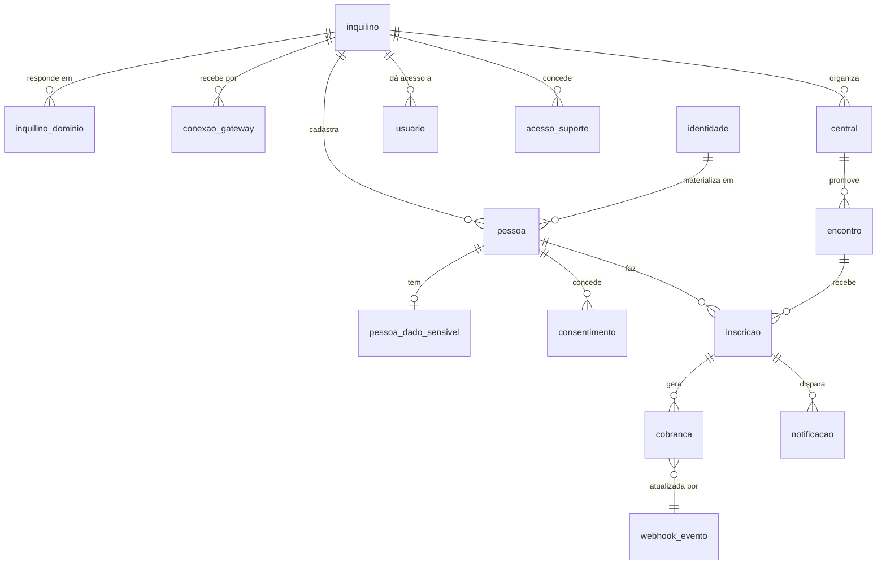

# 01 — Modelo de dados

Estratégia de isolamento, contexto de sessão e políticas de RLS estão em [00-multi-inquilino.md](00-multi-inquilino.md). Aqui está o schema.

## 1. Tipos

```sql
create type situacao_inquilino as enum (
  'em_implantacao', 'ativo', 'suspenso', 'encerrado'
);

create type situacao_encontro as enum (
  'rascunho', 'publicado', 'inscricoes_encerradas',
  'em_andamento', 'encerrado', 'cancelado'
);

create type tipo_inscricao as enum ('participante', 'servo');

create type situacao_inscricao as enum (
  'lista_espera', 'pendente_pagamento', 'confirmada',
  'presente', 'ausente', 'cancelada'
);

create type metodo_pagamento as enum ('pix', 'cartao_credito', 'presencial');

create type situacao_cobranca as enum (
  'criada', 'aguardando_pagamento', 'em_analise', 'paga',
  'recusada', 'expirada', 'cancelada',
  'estornada_parcial', 'estornada'
);

create type papel_usuario as enum (
  'inscrito', 'servo', 'coordenador_area', 'coordenador_encontro',
  'admin_central', 'admin_denominacao', 'operador'
);
```

`metodo_pagamento.presencial` cobre RN-070 (secretaria recebe dinheiro/pix na hora do check-in). Entra já na fase 1 porque a coluna faz parte da prestação de contas.

---

## 2. Plataforma

### 2.1 `inquilino`

```sql
create table inquilino (
  id                    uuid primary key,
  nome                  text not null,
  slug                  text not null unique,
  situacao              situacao_inquilino not null default 'em_implantacao',

  -- identidade visual
  logo_url              text,
  logo_horizontal_url   text,
  favicon_url           text,
  cor_primaria          text not null default '#1f2937',
  cor_secundaria        text not null default '#6b7280',
  cor_texto_sobre_primaria text not null default '#ffffff',

  -- rótulos (RN-008, RN-069t)
  rotulos               jsonb not null default '{}',

  -- áreas de servição padrão herdadas pelas centrais (RN-047a)
  areas_padrao          jsonb not null default '[]',

  -- plataforma
  taxa_plataforma_percentual numeric(5,3) not null default 0
                        check (taxa_plataforma_percentual between 0 and 100),
  taxa_repassada_ao_inscrito boolean not null default false,

  -- contrato
  contrato_versao       text,
  contrato_aceito_em    timestamptz,
  contrato_aceito_por   uuid,
  contrato_aceito_ip    inet,

  criado_em             timestamptz not null default now(),
  atualizado_em         timestamptz not null default now(),

  constraint inquilino_slug_formato check (slug ~ '^[a-z0-9]+(-[a-z0-9]+)*$'),
  constraint inquilino_ativo_tem_contrato check (
    situacao = 'em_implantacao' or contrato_aceito_em is not null
  )
);
```

`inquilino_ativo_tem_contrato` implementa parte de RN-076t no banco. A parte de recebimento conectado é validada na aplicação, porque depende de outra tabela.

`taxa_plataforma_percentual` com 3 casas decimais: 2,5% se escreve `2.500`.

### 2.2 `inquilino_dominio`

```sql
create table inquilino_dominio (
  id                uuid primary key,
  inquilino_id      uuid not null references inquilino(id),
  dominio           text not null unique,
  tipo              text not null,        -- subdominio | proprio
  verificado        boolean not null default false,
  token_verificacao text,
  verificado_em     timestamptz,
  principal         boolean not null default false,
  criado_em         timestamptz not null default now()
);

create unique index inquilino_dominio_principal_unico
  on inquilino_dominio (inquilino_id) where principal;
```

Tabela separada porque um inquilino tem o subdomínio da plataforma **e** pode ter domínio próprio, com o slug antigo continuando a responder depois de uma troca (RN-075t).

**RN-120 [NOVA]** — A resolução por host consulta esta tabela com `verificado = true`. Domínio não verificado existe no cadastro e não serve tráfego (RN-062t).

### 2.3 `conexao_gateway`

```sql
create table conexao_gateway (
  id                  uuid primary key,
  inquilino_id        uuid not null references inquilino(id),
  central_id          uuid references central(id),
  gateway             text not null default 'mercadopago',
  conta_externa_id    text not null,
  access_token_ref    text not null,
  refresh_token_ref   text not null,
  expira_em           timestamptz not null,
  escopos             text[],
  ativa               boolean not null default true,
  ultimo_refresh_em   timestamptz,
  falhas_refresh      smallint not null default 0,
  criado_em           timestamptz not null default now(),

  constraint conexao_gateway_unica unique (inquilino_id, central_id, gateway)
);
```

`central_id` nulo = conexão do inquilino inteiro; preenchido = conexão daquela central. Cobre os dois lados da decisão em aberto nº 2 do PRD sem exigir a resposta agora.

**RN-121 [NOVA]** — `access_token_ref` e `refresh_token_ref` guardam o **nome do secret** no cofre (Supabase Vault / Railway), nunca o token. Token de OAuth em tabela de aplicação é credencial de movimentar dinheiro alheio em texto legível.

**RN-122 [NOVA]** — Rotina diária renova todo token com menos de 15 dias para expirar. Renovação falhada incrementa `falhas_refresh` e alerta operador e admin da denominação. Na terceira falha, marca `ativa = false` e bloqueia novas cobranças **antes** de o inscrito descobrir na hora de pagar (RN-098).

**RN-123 [NOVA]** — A resolução da conexão para uma cobrança busca primeiro a da central; não achando, a do inquilino. Não achando nenhuma ativa, a criação da cobrança falha com `503 RECEBIMENTO_INDISPONIVEL` e alerta — nunca cria cobrança que não tem para onde mandar o dinheiro.

### 2.4 `acesso_suporte`

```sql
create table acesso_suporte (
  id              uuid primary key,
  inquilino_id    uuid not null references inquilino(id),
  operador_id     uuid not null,
  concedido_por   uuid not null,
  motivo          text not null,
  expira_em       timestamptz not null,
  revogado_em     timestamptz,
  criado_em       timestamptz not null default now(),

  constraint acesso_suporte_prazo_maximo check (
    expira_em <= criado_em + interval '24 hours'
  )
);
```

Implementa RN-078t a RN-081t. O prazo máximo é constraint de banco, não validação de aplicação.

---

## 3. Pessoas

### 3.1 `identidade`

Global, fora do isolamento por inquilino. É a única tabela assim, e por isso a mais protegida.

```sql
create table identidade (
  id              uuid primary key,
  cpf             char(11) not null unique,
  cpf_hash        bytea not null,
  nome_completo   text not null,
  data_nascimento date not null,
  criado_em       timestamptz not null default now(),
  atualizado_em   timestamptz not null default now()
);

create index on identidade (cpf_hash);

revoke all on identidade from app_api, app_publico;
```

**RN-124 [NOVA]** — Nenhum role de aplicação tem `select` nesta tabela (RN-067t). O único acesso é pela função abaixo:

```sql
create function resolver_identidade(
  p_cpf char(11), p_nome text, p_nascimento date
) returns uuid
language plpgsql security definer
as $$
declare v_id uuid;
begin
  select id into v_id from identidade where cpf = p_cpf;
  if v_id is null then
    insert into identidade (id, cpf, cpf_hash, nome_completo, data_nascimento)
    values (gen_random_uuid(), p_cpf, digest(p_cpf, 'sha256'), p_nome, p_nascimento)
    returning id into v_id;
  end if;
  return v_id;
end $$;
```

Ela devolve **um uuid e nada mais**. Não devolve nome, não diz se já existia, não indica em quantos inquilinos a pessoa aparece. É o que implementa RN-065t na camada mais baixa possível: mesmo um bug na aplicação não tem como vazar o que a função não retorna.

**RN-125 [NOVA]** — `resolver_identidade` nunca atualiza nome ou nascimento de identidade existente (RN-066t). O primeiro cadastro fixa o valor; cada inquilino guarda a sua versão em `pessoa`.

### 3.2 `pessoa`

```sql
create table pessoa (
  id                        uuid primary key,
  inquilino_id              uuid not null references inquilino(id),
  identidade_id             uuid not null references identidade(id),
  central_origem_id         uuid references central(id),
  nome_completo             text not null,
  nome_cracha               text not null,
  data_nascimento           date not null,
  telefone                  text not null,
  email                     text not null,
  cep                       char(8),
  logradouro                text,
  numero                    text,
  complemento               text,
  bairro                    text,
  cidade                    text,
  uf                        char(2),
  estado_civil              text,
  contato_emergencia_nome   text not null,
  contato_emergencia_fone   text not null,
  observacoes               text,
  anonimizada_em            timestamptz,
  criado_em                 timestamptz not null default now(),
  atualizado_em             timestamptz not null default now(),

  constraint pessoa_unica_por_inquilino unique (inquilino_id, identidade_id)
);

create index on pessoa (inquilino_id, nome_completo);
```

`pessoa_unica_por_inquilino` implementa RN-012. Repare que **não há coluna `cpf`**: o CPF vive só na identidade. Consulta por CPF passa por `resolver_identidade` e depois busca a pessoa pelo `identidade_id` dentro do inquilino.

**RN-126 [NOVA]** — A pessoa é do inquilino, não da central (RN-014). `central_origem_id` é informativo e não participa de nenhuma política de RLS. Restringir pessoa por central impediria que alguém de Cascavel servisse em Maringá — que é o caso de uso que motivou a decisão.

### 3.3 `pessoa_dado_sensivel`

```sql
create table pessoa_dado_sensivel (
  pessoa_id                 uuid primary key references pessoa(id) on delete cascade,
  inquilino_id              uuid not null references inquilino(id),
  restricao_alimentar       text,
  condicao_saude            text,
  medicamentos_uso_continuo text,
  religiao_declarada        text,
  plano_saude               text,
  criado_em                 timestamptz not null default now(),
  atualizado_em             timestamptz not null default now()
);
```

**RN-127 [NOVA]** — Nenhuma view, exportação ou listagem faz join com esta tabela. Acesso só por endpoint dedicado, auditado, restrito a `coordenador_encontro` e `admin_central`. Leitura é evento auditável, não só escrita.

**RN-128 [NOVA]** — Acesso de suporte (`acesso_suporte`) **não** alcança esta tabela em hipótese alguma (RN-080t). A política de RLS exclui o papel `operador` explicitamente, sem exceção por concessão.

### 3.4 `consentimento`

```sql
create table consentimento (
  id            uuid primary key,
  inquilino_id  uuid not null references inquilino(id),
  pessoa_id     uuid not null references pessoa(id),
  versao_termo  text not null,
  finalidades   text[] not null,
  aceito_em     timestamptz not null,
  ip            inet not null,
  user_agent    text,
  revogado_em   timestamptz
);
```

**RN-129 [NOVA]** — O termo é do inquilino, que é o controlador (PRD §9). `versao_termo` referencia o termo daquele inquilino, não um texto único da plataforma.

---

## 4. Domínio

### 4.1 `central`

```sql
create table central (
  id                  uuid primary key,
  inquilino_id        uuid not null references inquilino(id),
  nome                text not null,
  cidade              text not null,
  uf                  char(2) not null,
  slug                text not null,
  logo_url            text,
  email_contato       text,
  telefone_contato    text,
  ativa               boolean not null default true,

  parcela_minima      numeric(10,2) not null default 50.00,
  max_parcelas        smallint not null default 12
                      check (max_parcelas between 1 and 12),

  reembolso_faixas    jsonb not null default
                      '[{"dias":15,"percentual":100},{"dias":7,"percentual":50},{"dias":0,"percentual":0}]',

  criado_em           timestamptz not null default now(),
  atualizado_em       timestamptz not null default now(),

  constraint central_slug_unico_por_inquilino unique (inquilino_id, slug)
);
```

`central_slug_unico_por_inquilino` implementa RN-009: duas denominações podem ter, cada uma, sua `cascavel-pr`.

`reembolso_faixas` é lista ordenada por `dias` decrescente; aplica-se a primeira faixa cujo `dias` seja menor ou igual à antecedência do cancelamento.

**RN-130 [NOVA]** — A central herda `reembolso_faixas`, `parcela_minima` e `max_parcelas` do inquilino na criação, e pode sobrescrever. Herança é cópia no momento da criação, não referência: mudar a política da denominação não altera retroativamente a de centrais existentes, cujos encontros já foram divulgados com aquela regra.

### 4.2 `encontro`

```sql
create table encontro (
  id                    uuid primary key,
  inquilino_id          uuid not null references inquilino(id),
  central_id            uuid not null references central(id),
  numero                integer not null,
  titulo                text not null,
  slug                  text not null,
  data_inicio           date not null,
  data_fim              date not null,
  local_nome            text not null,
  local_endereco        text not null,
  local_cidade          text not null,
  local_uf              char(2) not null,
  vagas_participantes   smallint not null check (vagas_participantes > 0),
  vagas_servos          smallint not null check (vagas_servos > 0),
  taxa_participante     numeric(10,2) not null check (taxa_participante >= 0),
  taxa_servo            numeric(10,2) not null check (taxa_servo >= 0),
  inscricoes_abrem_em   timestamptz not null,
  inscricoes_fecham_em  timestamptz not null,
  situacao              situacao_encontro not null default 'rascunho',
  texto_divulgacao      text,
  imagem_capa_url       text,
  criado_em             timestamptz not null default now(),
  atualizado_em         timestamptz not null default now(),

  constraint encontro_numero_unico_por_central unique (central_id, numero),
  constraint encontro_slug_unico_por_central   unique (central_id, slug),
  constraint encontro_datas_coerentes          check (data_fim >= data_inicio),
  constraint encontro_janela_coerente          check (inscricoes_fecham_em > inscricoes_abrem_em)
);
```

`encontro_numero_unico_por_central` implementa RN-020. Como `central_id` é único na plataforma, a numeração fica automaticamente isolada por inquilino — o "2º Encontro" da Homens de Fé de Cascavel e o da Tabor de Cascavel coexistem.

**RN-131 [NOVA]** — `numero` é sugerido por `max(numero) + 1` na central, mas gravado como valor fixo e editável (RN-020). Não é sequence: o PRD prevê ajuste manual para acomodar edições anteriores ao sistema.

**RN-132 [NOVA]** — `titulo` é armazenado formatado (`2º Encontro Homens de Fé de Cascavel-PR`), não montado em exibição. A interface **sugere** o padrão do inquilino na criação, aplicando os rótulos, e o admin pode editar.

**Publicação** — `rascunho → publicado` exige vagas, taxas, janela no futuro, local, texto de divulgação, **e inquilino `ativo` com recebimento conectado**. Falta de qualquer um retorna `422 ENCONTRO_INCOMPLETO` com a lista.

### 4.3 `inscricao`

```sql
create table inscricao (
  id                    uuid primary key,
  inquilino_id          uuid not null references inquilino(id),
  central_id            uuid not null references central(id),
  encontro_id           uuid not null references encontro(id),
  pessoa_id             uuid not null references pessoa(id),
  tipo                  tipo_inscricao not null,
  situacao              situacao_inscricao not null,
  convidador_pessoa_id  uuid references pessoa(id),
  convidador_nome_livre text,
  area_pretendida       text,
  valor_devido          numeric(10,2) not null check (valor_devido >= 0),
  token_consulta        text not null unique,
  posicao_espera        integer,
  espera_promovida_em   timestamptz,
  espera_expira_em      timestamptz,
  cancelada_em          timestamptz,
  motivo_cancelamento   text,
  criado_em             timestamptz not null default now(),
  atualizado_em         timestamptz not null default now(),

  constraint inscricao_espera_coerente check (
    (situacao = 'lista_espera') = (posicao_espera is not null)
  ),
  constraint inscricao_convidador_exclusivo check (
    num_nonnulls(convidador_pessoa_id, convidador_nome_livre) <= 1
  )
);

-- RN-031: uma inscrição ativa por pessoa por encontro
create unique index inscricao_ativa_unica
  on inscricao (encontro_id, pessoa_id)
  where situacao <> 'cancelada';

-- fila estável da lista de espera
create unique index inscricao_posicao_espera_unica
  on inscricao (encontro_id, tipo, posicao_espera)
  where situacao = 'lista_espera';

create index on inscricao (encontro_id, situacao, tipo);
create index on inscricao (inquilino_id, criado_em desc);
```

`inscricao_ativa_unica` implementa RN-031 **no banco**. Verificação em código não resolve: duas requisições simultâneas passam pelas duas validações antes de qualquer insert.

**RN-133 [NOVA]** — `token_consulta` é aleatório de 32 bytes em base64url, sem relação com o `id`, e único na plataforma inteira — não por inquilino. É credencial de acesso sem login: não aparece em log, não vai em query string de redirect, só em corpo de resposta e no link enviado por e-mail.

**Campos ausentes de propósito** — `grupo_id`, `area_servicao_id`, `funcao`, `data_checkin` são da fase 2.

### 4.4 `cobranca`

```sql
create table cobranca (
  id                     uuid primary key,
  inquilino_id           uuid not null references inquilino(id),
  central_id             uuid not null references central(id),
  inscricao_id           uuid not null references inscricao(id),
  conexao_gateway_id     uuid references conexao_gateway(id),
  metodo                 metodo_pagamento not null,
  parcelas               smallint not null default 1 check (parcelas between 1 and 12),

  valor                  numeric(10,2) not null check (valor > 0),
  taxa_plataforma        numeric(10,2) not null default 0 check (taxa_plataforma >= 0),
  taxa_plataforma_percentual numeric(5,3) not null default 0,
  valor_liquido          numeric(10,2),
  situacao               situacao_cobranca not null default 'criada',

  gateway                text not null default 'mercadopago',
  gateway_pagamento_id   text,
  idempotency_key        uuid not null,

  pix_qr_code            text,
  pix_qr_code_base64     text,
  link_pagamento         text,

  expira_em              timestamptz,
  pago_em                timestamptz,
  atualizado_em_gateway  timestamptz,
  motivo_recusa          text,

  valor_estornado        numeric(10,2) not null default 0 check (valor_estornado >= 0),
  taxa_estornada         numeric(10,2) not null default 0 check (taxa_estornada >= 0),
  estornado_em           timestamptz,

  criado_em              timestamptz not null default now(),
  atualizado_em          timestamptz not null default now(),

  constraint cobranca_gateway_id_unico   unique (gateway, gateway_pagamento_id),
  constraint cobranca_idempotency_unica  unique (idempotency_key),
  constraint cobranca_estorno_ate_o_valor check (valor_estornado <= valor),
  constraint cobranca_taxa_ate_o_valor    check (taxa_plataforma <= valor),
  constraint cobranca_parcelas_so_cartao  check (
    metodo = 'cartao_credito' or parcelas = 1
  )
);

create unique index cobranca_viva_unica
  on cobranca (inscricao_id)
  where situacao in ('criada', 'aguardando_pagamento', 'em_analise');

create index on cobranca (situacao, expira_em)
  where situacao = 'aguardando_pagamento';

create index on cobranca (inquilino_id, pago_em)
  where situacao = 'paga';
```

`cobranca_viva_unica` impede o defeito clássico: usuário clica duas vezes, o sistema gera dois Pix e a pessoa paga os dois.

**RN-134 [NOVA]** — `taxa_plataforma_percentual` é copiado do inquilino e congelado junto com o valor (RN-043, RN-083t). Guardar o percentual além do valor permite auditar o cálculo anos depois, quando o percentual vigente já for outro.

**RN-143 [NOVA]** — `idempotency_key` é gerada **antes** da chamada ao gateway e persistida junto com a cobrança em `criada`. Se a chamada falhar por timeout, o retry usa a mesma chave e o Mercado Pago devolve o pagamento original em vez de criar outro. Gerar a chave depois da resposta não protege de nada.

**RN-144 [NOVA]** — Cobrança em `criada` há mais de 15 minutos sem `gateway_pagamento_id` é investigada pela reconciliação pela `idempotency_key` antes de qualquer nova tentativa.

O índice em `(inquilino_id, pago_em)` sustenta a apuração de faturamento da plataforma sem varredura.

### 4.5 `webhook_evento`

```sql
create table webhook_evento (
  id                  uuid primary key,
  inquilino_id        uuid references inquilino(id),
  gateway             text not null default 'mercadopago',
  notificacao_id      text not null,
  tipo                text not null,
  acao                text,
  recurso_id          text not null,
  assinatura_valida   boolean not null,
  corpo_bruto         jsonb not null,
  cabecalhos          jsonb not null,
  recebido_em         timestamptz not null default now(),
  processado_em       timestamptz,
  resultado           text,
  erro                text,
  tentativas          smallint not null default 0,

  constraint webhook_evento_unico unique (gateway, notificacao_id)
);

create index on webhook_evento (recurso_id, recebido_em desc);
create index on webhook_evento (processado_em) where processado_em is null;
```

**RN-135 [NOVA]** — `inquilino_id` é **nullable** e esta é a única tabela de domínio que não tem RLS por inquilino. Motivo: o webhook chega antes de sabermos de quem é, e a rota já identifica o inquilino (RN-405), mas evento órfão pode não ter dono nenhum. O acesso é restrito ao processador e ao operador; a tabela não é exposta em nenhum endpoint de inquilino.

### 4.6 `notificacao`

```sql
create table notificacao (
  id            uuid primary key,
  inquilino_id  uuid not null references inquilino(id),
  central_id    uuid references central(id),
  inscricao_id  uuid references inscricao(id),
  gatilho       text not null,
  canal         text not null,
  destinatario  text not null,
  chave_unica   text not null,
  situacao      text not null default 'pendente',
  tentativas    smallint not null default 0,
  enviada_em    timestamptz,
  erro          text,
  criado_em     timestamptz not null default now(),

  constraint notificacao_chave_unica unique (chave_unica)
);
```

**RN-136 [NOVA]** — `chave_unica` = `{gatilho}:{inscricao_id}:{discriminador}`, com `inscricao_id` sendo uuid global. Garante a parte "nem duplica notificação" de RN-050 sem depender de contexto de inquilino.

**RN-137 [NOVA]** — O remetente e a assinatura do e-mail usam a marca e os rótulos do inquilino (RN-070t). Um e-mail da plataforma chegando com nome genérico faz o inscrito achar que é golpe.

### 4.7 `auditoria`

```sql
create table auditoria (
  id            uuid primary key,
  inquilino_id  uuid,
  central_id    uuid,
  entidade      text not null,
  entidade_id   uuid not null,
  acao          text not null,
  ator_tipo     text not null,   -- usuario | sistema | webhook | publico | operador
  ator_id       uuid,
  antes         jsonb,
  depois        jsonb,
  ip            inet,
  criado_em     timestamptz not null default now()
);

create index on auditoria (entidade, entidade_id, criado_em desc);
create index on auditoria (inquilino_id, criado_em desc);
create index on auditoria (ator_tipo, criado_em desc) where ator_tipo = 'operador';
```

**RN-138 [NOVA]** — `auditoria` é append-only: `app_api` tem `insert` e `select`, não tem `update` nem `delete`.

**RN-139 [NOVA]** — Toda leitura feita sob acesso de suporte grava aqui com `ator_tipo = 'operador'` (RN-079t). O índice parcial serve à tela em que o admin da denominação revisa o que o operador viu.

### 4.8 `usuario`

```sql
create table usuario (
  id            uuid primary key,
  auth_id       uuid not null,      -- auth.users do Supabase
  inquilino_id  uuid references inquilino(id),
  central_id    uuid references central(id),
  pessoa_id     uuid references pessoa(id),
  papel         papel_usuario not null,
  ativo         boolean not null default true,
  criado_em     timestamptz not null default now(),

  constraint usuario_unico unique (auth_id, inquilino_id),
  constraint usuario_operador_sem_inquilino check (
    (papel = 'operador') = (inquilino_id is null)
  ),
  constraint usuario_denominacao_sem_central check (
    papel <> 'admin_denominacao' or central_id is null
  )
);
```

**RN-140 [NOVA]** — Uma conta pertence a um inquilino (RN-004). Servir em duas denominações exige dois acessos, com e-mails distintos ou com o mesmo e-mail em contas separadas — nunca troca de contexto numa sessão. Alternar inquilino dentro de uma sessão é como se constrói, sem querer, o caminho de travessia entre inquilinos.

---

## 5. RLS

Padrão descrito em [00-multi-inquilino.md](00-multi-inquilino.md#23-política-padrão), aplicado a: `central`, `encontro`, `inscricao`, `cobranca`, `pessoa`, `pessoa_dado_sensivel`, `consentimento`, `notificacao`, `auditoria`, `conexao_gateway`, `usuario`.

Exceções, todas justificadas:

| Tabela | Tratamento |
|---|---|
| `identidade` | global, sem RLS, sem `select` para role de aplicação (RN-124) |
| `webhook_evento` | sem RLS por inquilino, acesso só do processador (RN-135) |
| `inquilino` | leitura da própria linha; escrita só pelo operador |
| `inquilino_dominio` | leitura pública **apenas** do host consultado, por função dedicada |

**RN-141 [NOVA]** — Existe teste automatizado que enumera `pg_tables` e falha se alguma tabela de domínio estiver sem `enable row level security` **e** `force row level security`. Tabela nova entra no sistema sem proteção com uma facilidade que só um teste dessa forma pega — revisão de PR não pega.

---

## 6. Retenção e anonimização

**RN-093** por rotina mensal:

1. Seleciona `pessoa` cuja última inscrição pertence a encontro `encerrado` há mais de 5 anos, sem consentimento de retenção ativo.
2. Substitui PII por marcadores, grava `anonimizada_em`.
3. `delete` em `pessoa_dado_sensivel`.
4. Mantém `inscricao` e `cobranca` intactas — valor pago é registro contábil (RN-092).
5. Se a identidade não tiver mais nenhuma pessoa não-anonimizada em nenhum inquilino, apaga a `identidade` (RN-099).

**RN-142 [NOVA]** — O passo 5 é a única operação que atravessa a fronteira do inquilino, e roda como rotina de sistema, jamais a pedido de um inquilino. Um inquilino não pode provocar, nem observar, efeito no cadastro de outro.

---

## 7. Diagrama


