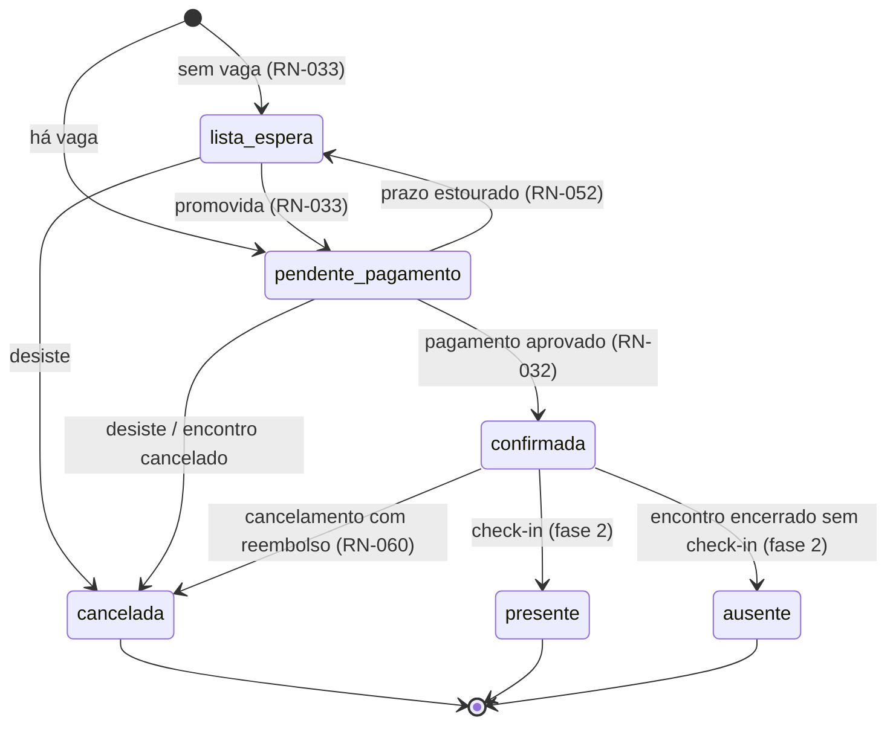

# 02 — Inscrição

## 1. Máquina de estados



Transições permitidas, nada além disso:

| De | Para | Gatilho | Quem |
|---|---|---|---|
| — | `lista_espera` | inscrição sem vaga | público / coordenação |
| — | `pendente_pagamento` | inscrição com vaga | público / coordenação |
| `lista_espera` | `pendente_pagamento` | vaga liberada | sistema |
| `lista_espera` | `cancelada` | desistência | inscrito / coordenação |
| `pendente_pagamento` | `confirmada` | webhook de aprovação | sistema |
| `pendente_pagamento` | `confirmada` | baixa manual | coordenação |
| `pendente_pagamento` | `lista_espera` | 72h sem pagar (RN-052) | sistema |
| `pendente_pagamento` | `cancelada` | desistência / encontro cancelado | inscrito / coordenação |
| `confirmada` | `cancelada` | cancelamento com reembolso | inscrito / coordenação |

**RN-200 [NOVA]** — Toda transição é executada por um único serviço de domínio (`InscricaoService.transicionar`), que valida a origem, grava auditoria e enfileira notificação numa mesma transação. Nenhum `update situacao` fora dele. Transição não prevista na tabela retorna `409 CONFLITO_DE_SITUACAO` com a situação atual e a pretendida.

**RN-201 [NOVA]** — `confirmada → pendente_pagamento` não existe. Se um pagamento aprovado for estornado depois da confirmação, a inscrição vai para `cancelada`, não volta para pendente. Motivo: a vaga já foi comunicada como garantida e o retorno silencioso a "pendente" confunde o inscrito e a secretaria. *Confirmar com você — é a regra que eu chutei com menos apoio no PRD.*

---

## 2. Regras de criação

### 2.1 Janela de inscrição

**RN-202 [NOVA]** — Aceita inscrição apenas se:

- `encontro.situacao = 'publicado'`
- `now() between inscricoes_abrem_em and inscricoes_fecham_em`

Fora da janela: `422 INSCRICOES_FECHADAS`. Nunca esconder o botão como única defesa — link antigo compartilhado em grupo de WhatsApp continua sendo clicado semanas depois.

### 2.2 Identidade e deduplicação de pessoa (RN-010 a RN-014)

Ao receber a ficha:

1. `resolver_identidade(cpf, nome, nascimento)` devolve o `identidade_id` — criando a identidade se for a primeira vez na plataforma. A função devolve **só o uuid** ([01-modelo-de-dados.md](01-modelo-de-dados.md#31-identidade)).
2. Busca `pessoa` por `(inquilino_id, identidade_id)`.
3. Achou → reaproveita o registro e **atualiza** telefone, e-mail e endereço com o que veio na ficha. Não sobrescreve `nome_completo` (evita que erro de digitação apague o cadastro histórico); divergência de nome vira alerta na coordenação.
4. Não achou → cria a pessoa **do zero**, com o que veio na ficha (RN-013). Nada é copiado de outro inquilino.

**RN-212 [NOVA]** — A resposta da API é **idêntica** havendo ou não identidade prévia em outro inquilino: mesmo código, mesmo corpo, mesma latência perceptível. A ficha não autopreenche nada e não exibe "já cadastrado". Um inquilino não descobre, por diferença de comportamento, que a pessoa passou por outra denominação (RN-065t, RN-094a).

**RN-213 [NOVA]** — A pessoa é do inquilino, não da central. Quem viveu o encontro em Cascavel e se inscreve para servir em Maringá — mesma denominação — é reconhecido, sem recadastro. Entre denominações, não.

`pessoa_dado_sensivel` é sempre sobrescrito com o que veio na ficha: restrição alimentar e medicamento mudam entre um encontro e outro, e o dado da inscrição atual é o que a cozinha e a equipe de saúde precisam.

### 2.3 Uma inscrição ativa por encontro (RN-031)

Garantido por índice parcial ([01-modelo-de-dados.md](01-modelo-de-dados.md#36-inscricao)). Violação vira `409 JA_INSCRITO`, com a situação da inscrição existente e o link de consulta — a pessoa quase sempre esqueceu que já se inscreveu, e mandá-la para a própria inscrição resolve sem passar pela secretaria.

Se a inscrição existente estiver `cancelada`, a nova é aceita normalmente.

### 2.4 Valor devido

**RN-203 [NOVA]** — `valor_devido` é copiado da taxa do encontro no momento da inscrição, não lido por join na hora de cobrar. Se a central reajustar a taxa, quem já se inscreveu mantém o valor original. Sem essa cópia, um reajuste altera retroativamente a dívida de todo mundo que ainda não pagou.

`tipo = participante` → `taxa_participante`. `tipo = servo` → `taxa_servo` (RN — servo paga taxa reduzida de alimentação).

### 2.5 Vagas

Contagem de ocupação por tipo:

```sql
select count(*) from inscricao
where encontro_id = $1
  and tipo = $2
  and situacao in ('pendente_pagamento', 'confirmada', 'presente');
```

`lista_espera`, `cancelada` e `ausente` não ocupam vaga. `pendente_pagamento` **ocupa** — é o que dá sentido ao prazo de 72h da RN-052.

O controle de concorrência dessa contagem está em [05-lista-de-espera.md](05-lista-de-espera.md#3-concorrência-na-última-vaga). É o ponto mais delicado da fase.

### 2.6 Área pretendida do servo

`area_pretendida` é texto livre de preferência, não vínculo. A alocação real é fase 2 (RN-047). O formulário deixa explícito: "preferência, sujeita à definição da coordenação".

### 2.7 Consentimento (RN-090)

**RN-204 [NOVA]** — A inscrição e o registro em `consentimento` são gravados na mesma transação. Inscrição sem consentimento correspondente não pode existir — é o registro que sustenta o tratamento de dado sensível. Se a gravação do consentimento falhar, a inscrição inteira reverte.

---

## 3. Cancelamento e reembolso (F3)

### 3.1 Cálculo

Antecedência = `encontro.data_inicio - hoje`, em dias corridos.

Percorre `central.reembolso_faixas` ordenado por `dias` decrescente e aplica a primeira faixa cujo `dias` seja menor ou igual à antecedência.

Padrão RN-060: >= 15 dias → 100%; >= 7 dias → 50%; abaixo → 0%.

**RN-205 [NOVA]** — O percentual incide sobre o valor **efetivamente pago**, não sobre `valor_devido`. Taxa do gateway não é devolvida ao inscrito nem descontada dele: entra como despesa da central na prestação de contas (fase 3). Decisão que precisa da sua confirmação — algumas centrais preferem descontar do inscrito.

**RN-206 [NOVA]** — Cancelamento de inscrição `pendente_pagamento` não gera reembolso nem chama o gateway; apenas cancela a cobrança viva e libera a vaga.

**RN-207 [NOVA]** — Cancelamento do **encontro** (`encontro.situacao = 'cancelado'`) reembolsa 100% de todas as inscrições confirmadas, ignorando as faixas. A política de faixas pune desistência do inscrito, não da organização.

### 3.2 Ordem das operações

1. Valida que a inscrição admite cancelamento.
2. Calcula o percentual e o valor.
3. Se há valor a estornar, chama o gateway ([03-cobranca.md](03-cobranca.md#6-estorno)).
4. **Só depois do estorno aceito**, grava `inscricao.situacao = 'cancelada'`.
5. Libera a vaga e dispara a promoção da lista de espera (RN-033).
6. Notifica.

**RN-208 [NOVA]** — Se o estorno falhar no gateway, a inscrição **não** é cancelada: retorna `502 FALHA_NO_ESTORNO` e o caso vai para uma fila de pendências que a coordenação enxerga. Cancelar antes de estornar produz o pior resultado possível — pessoa fora do retiro e sem o dinheiro de volta.

---

## 4. Endpoints

Base pública: `/api/publico`. Base autenticada: `/api/admin`.

**O inquilino nunca aparece na URL nem no corpo.** É resolvido pelo `Host` da requisição na área pública, e pelo vínculo do usuário na área autenticada (RN-059t, RN-060t). Endpoint público que aceitasse `inquilinoId` como parâmetro seria a porta de travessia entre denominações.

### 4.1 `GET /api/publico/encontros`

Agenda da denominação do host. Sem autenticação.

Query: `uf`, `centralSlug`, `de`, `ate`, `pagina` (padrão 1), `tamanho` (padrão 20, máx 50).

`200`:

```json
{
  "itens": [
    {
      "id": "01903f...",
      "central": { "slug": "cascavel-pr", "nome": "Central de Cascavel", "cidade": "Cascavel", "uf": "PR" },
      "numero": 2,
      "titulo": "2º Encontro Homens de Fé de Cascavel-PR",
      "slug": "2-encontro-homens-de-fe",
      "dataInicio": "2026-09-11",
      "dataFim": "2026-09-13",
      "localNome": "Recanto Nossa Senhora",
      "localCidade": "Cascavel",
      "localUf": "PR",
      "imagemCapaUrl": "https://...",
      "taxaParticipante": 350.00,
      "vagasRestantesParticipante": 12,
      "inscricoesAbertas": true
    }
  ],
  "total": 37,
  "pagina": 1
}
```

Só encontros `publicado` (RN-022), **só do inquilino do host** (RN-016). Nunca expõe dado de pessoa.

**RN-214 [NOVA]** — A resposta inclui o bloco de contexto do inquilino (marca e rótulos) numa requisição só, para o SSR renderizar com a identidade correta sem segunda ida ao servidor (RN-071t):

```json
"inquilino": {
  "nome": "Homens de Fé",
  "logoUrl": "https://...",
  "corPrimaria": "#1f2937",
  "corTextoSobrePrimaria": "#ffffff",
  "rotulos": { "participante": { "singular": "Encontrista" }, "servo": { "singular": "Obreiro" } }
}
```

**RN-209 [NOVA]** — `vagasRestantesParticipante` é informativo e pode estar desatualizado em segundos de pico. A decisão de aceitar a inscrição é sempre refeita na criação, sob lock (RNF — ver 05). A interface não trata esse número como garantia.

### 4.2 `GET /api/publico/encontros/:centralSlug/:encontroSlug`

Página do encontro. Mesmo payload acrescido de `textoDivulgacao`, `localEndereco`, `taxaServo`, `vagasRestantesServo`, `inscricoesAbremEm`, `inscricoesFechamEm`, `maxParcelas`, `parcelaMinima`.

`404 ENCONTRO_NAO_ENCONTRADO` para encontro não publicado — não distingue "não existe" de "não publicado".

### 4.3 `POST /api/publico/encontros/:encontroId/inscricoes`

Cria a inscrição. Sem autenticação, com rate limit.

```json
{
  "tipo": "participante",
  "pessoa": {
    "nomeCompleto": "João da Silva Souza",
    "nomeCracha": "João",
    "cpf": "12345678901",
    "dataNascimento": "1985-04-23",
    "telefone": "45999998888",
    "email": "joao@exemplo.com",
    "cep": "85810000",
    "logradouro": "Rua das Flores",
    "numero": "120",
    "complemento": "apto 3",
    "bairro": "Centro",
    "cidade": "Cascavel",
    "uf": "PR",
    "estadoCivil": "casado",
    "contatoEmergenciaNome": "Maria de Souza",
    "contatoEmergenciaFone": "45988887777"
  },
  "dadosSensiveis": {
    "restricaoAlimentar": "intolerante a lactose",
    "condicaoSaude": "hipertensão",
    "medicamentosUsoContinuo": "losartana 50mg",
    "planoSaude": "Unimed"
  },
  "convidadorPessoaId": null,
  "convidadorNomeLivre": "Pedro Alves",
  "areaPretendida": null,
  "consentimento": { "versaoTermo": "2026-01", "finalidades": ["inscricao", "saude", "comunicacao"] }
}
```

`201`:

```json
{
  "inscricaoId": "01903f...",
  "situacao": "pendente_pagamento",
  "valorDevido": 350.00,
  "tokenConsulta": "V1StGXR8_Z5jdHi6B-myT...",
  "urlConsulta": "https://app/inscricao/V1StGXR8...",
  "posicaoEspera": null,
  "prazoPagamentoAte": "2026-08-25T18:00:00Z"
}
```

Em lista de espera, `201` com `situacao: "lista_espera"`, `posicaoEspera: 4`, `valorDevido` presente mas **sem cobrança criada** (RN-033).

Erros: `422 INSCRICOES_FECHADAS`, `409 JA_INSCRITO`, `422 DADOS_INVALIDOS`, `422 CONSENTIMENTO_OBRIGATORIO`, `404 ENCONTRO_NAO_ENCONTRADO`, `429 MUITAS_TENTATIVAS`, `503 INSCRICOES_SUSPENSAS` (inquilino suspenso — RN-063t), `503 RECEBIMENTO_INDISPONIVEL` (conexão de gateway inativa — RN-123).

**RN-210 [NOVA]** — Rate limit de 5 inscrições por IP a cada 10 minutos e 3 por CPF por hora. Endpoint público que grava PII e dispara e-mail é alvo fácil de abuso.

**RN-211 [NOVA]** — O IP registrado no consentimento vem de `X-Forwarded-For` respeitando o proxy da Vercel/Railway, com a cadeia de proxies confiáveis configurada explicitamente. IP de consentimento LGPD que registra o IP do load balancer é inútil.

### 4.4 `GET /api/publico/inscricoes/:token`

Consulta pelo token (RN-133).

```json
{
  "encontro": { "titulo": "2º Encontro Homens de Fé de Cascavel-PR", "dataInicio": "2026-09-11", "localNome": "Recanto Nossa Senhora" },
  "pessoa": { "nomeCompleto": "João da Silva Souza", "email": "joa***@exemplo.com" },
  "tipo": "participante",
  "situacao": "pendente_pagamento",
  "valorDevido": 350.00,
  "posicaoEspera": null,
  "prazoPagamentoAte": "2026-08-25T18:00:00Z",
  "cobranca": {
    "id": "01903f...",
    "metodo": "pix",
    "situacao": "aguardando_pagamento",
    "expiraEm": "2026-08-23T18:00:00Z",
    "pixQrCode": "00020126580014BR.GOV.BCB.PIX...",
    "pixQrCodeBase64": "iVBORw0KG...",
    "podeRegerar": true
  },
  "politicaReembolso": { "percentualAtual": 100, "validoAte": "2026-08-27" }
}
```

Nunca retorna `dadosSensiveis` (RN-091). E-mail sai mascarado — o token pode ter vazado em um grupo de mensagem.

`404 INSCRICAO_NAO_ENCONTRADA` para token inválido. Comparação do token em tempo constante.

### 4.5 `PATCH /api/publico/inscricoes/:token`

Atualiza dados até `inscricoes_fecham_em`. Aceita apenas `pessoa` (telefone, e-mail, endereço, contato de emergência) e `dadosSensiveis`. CPF, tipo e encontro não são editáveis.

`422 INSCRICOES_FECHADAS` depois do prazo — daí em diante só a secretaria altera.

### 4.6 `POST /api/publico/inscricoes/:token/cancelar`

```json
{ "motivo": "conflito de agenda" }
```

`200`: `{ "situacao": "cancelada", "reembolso": { "percentual": 100, "valor": 350.00, "situacao": "solicitado", "prazoEstimadoDias": 10 } }`

Erros: `409 CONFLITO_DE_SITUACAO`, `502 FALHA_NO_ESTORNO` (RN-208).

### 4.7 Endpoints administrativos

| Método | Rota | Papel mínimo |
|---|---|---|
| `GET` | `/api/admin/encontros/:id/inscricoes` | coordenador_encontro |
| `POST` | `/api/admin/encontros/:id/inscricoes` | coordenador_encontro |
| `PATCH` | `/api/admin/inscricoes/:id/situacao` | coordenador_encontro |
| `POST` | `/api/admin/inscricoes/:id/baixa-manual` | coordenador_encontro |
| `POST` | `/api/admin/inscricoes/:id/cancelar` | coordenador_encontro |
| `GET` | `/api/admin/inscricoes/:id/dados-sensiveis` | coordenador_encontro |
| `GET` | `/api/admin/encontros/:id/lista-espera` | coordenador_encontro |
| `POST` | `/api/admin/encontros/:id/lista-espera/promover` | coordenador_encontro |
| `GET` | `/api/admin/denominacao/resumo` | admin_denominacao |
| `GET` | `/api/admin/denominacao/centrais` | admin_denominacao |

**RN-215 [NOVA]** — Rota administrativa **nunca** recebe `inquilinoId`. O acesso a um recurso de outro inquilino devolve `404`, não `403` — `403` confirmaria que o id existe em algum lugar da plataforma (RN-052t).

`POST /inscricoes` administrativo implementa RN-035 (servo inscrito pela coordenação, sem passar pelo site).

`GET /dados-sensiveis` é endpoint isolado e cada acesso grava em `auditoria` (RN-127).

`POST /baixa-manual` registra pagamento recebido fora do gateway:

```json
{ "metodo": "presencial", "valorRecebido": 350.00, "recebidoEm": "2026-09-11T22:10:00Z", "observacao": "pix na recepção" }
```

Cria `cobranca` com `metodo = 'presencial'`, situação `paga`, sem `gateway_pagamento_id`, e confirma a inscrição. Sempre auditado com o usuário que lançou.

### 4.8 Listagem administrativa

`GET /api/admin/encontros/:id/inscricoes`

Query: `tipo`, `situacao` (múltipla), `busca` (nome/CPF/e-mail), `ordenar` (`criado_em`, `nome`, `posicao_espera`), `pagina`, `tamanho`.

Retorna a inscrição com pessoa (sem dado sensível) e um resumo da cobrança. Cabeçalho `X-Total-Count`.

Resumo agregado em `GET /api/admin/encontros/:id/resumo`:

```json
{
  "participantes": { "vagas": 60, "confirmadas": 41, "pendentes": 7, "listaEspera": 3, "canceladas": 2 },
  "servos": { "vagas": 40, "confirmadas": 33, "pendentes": 1, "listaEspera": 0, "canceladas": 1 },
  "financeiro": { "arrecadado": 18250.00, "aReceber": 2800.00, "estornado": 700.00 }
}
```

---

## 5. Notificações desta fase

| Gatilho | `chave_unica` | Quando |
|---|---|---|
| `inscricao_criada` | `inscricao_criada:{id}:1` | criação com vaga |
| `lista_espera_registrada` | `lista_espera_registrada:{id}:1` | criação sem vaga |
| `pagamento_aprovado` | `pagamento_aprovado:{id}:{cobranca_id}` | webhook aprovado |
| `pagamento_pendente_24h` | `pagamento_pendente:{id}:24` | 24h sem pagar |
| `pagamento_pendente_48h` | `pagamento_pendente:{id}:48` | 48h sem pagar |
| `vaga_liberada` | `vaga_liberada:{id}:{promovida_em}` | promoção da espera |
| `inscricao_cancelada` | `inscricao_cancelada:{id}:1` | cancelamento |
| `reembolso_efetivado` | `reembolso_efetivado:{id}:{cobranca_id}` | estorno confirmado |

Na fase 1 o canal é e-mail. WhatsApp fica como link `wa.me` gerado na tela da secretaria (decisão em aberto nº 1 do PRD).

O discriminador de `vaga_liberada` usa `espera_promovida_em` porque a mesma pessoa pode ser promovida, perder o prazo, voltar para a fila e ser promovida de novo. Chave fixa bloquearia o segundo aviso, legítimo.
