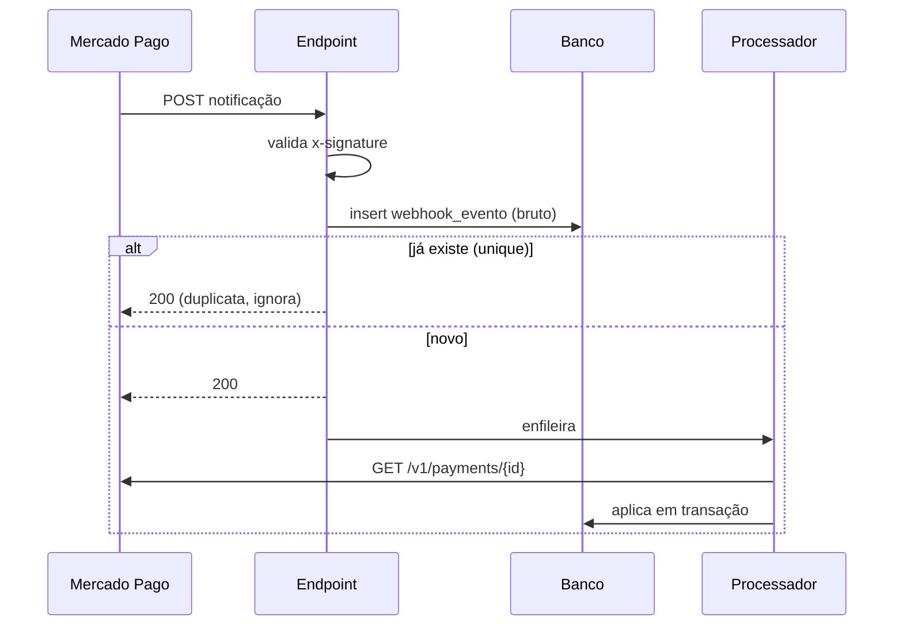

# 04 — Webhook de pagamento

Implementa F2 do PRD, RN-050, RN-051 e RNF-004. É o componente mais crítico da fase: é ele que transforma dinheiro recebido em vaga garantida.

## 1. Premissas sobre o gateway

Tratadas como certas, porque acontecem:

1. **Entrega mais de uma vez.** O mesmo evento chega duas, três vezes.
2. **Entrega fora de ordem.** `approved` pode chegar antes de `pending`.
3. **Pode não entregar.** Instabilidade nossa ou do gateway derruba a notificação. Por isso existe reconciliação (seção 6).
4. **O corpo é magro.** Vem o id do recurso, não o estado. O estado se busca.
5. **Exige resposta rápida.** Demora vira retry, que vira mais carga.

**RN-400 [NOVA]** — O corpo do webhook **nunca** é fonte de verdade sobre a situação do pagamento. Recebido o evento, consultamos `GET /v1/payments/{id}` e usamos a resposta. O corpo serve para saber *o que* consultar. Isso resolve boa parte do problema de ordem: consulta sempre traz o estado atual, não o de quando o evento foi emitido.

---

## 2. Recepção

`POST /api/webhooks/mercadopago/:inquilinoSlug`

Público, sem autenticação de sessão — autenticado por assinatura.

**RN-417 [NOVA]** — O slug na rota diz **qual secret usar para validar**, não em quem confiar. Ele é entrada não confiável: um slug apontando para o inquilino errado simplesmente faz a assinatura não bater, e a requisição é rejeitada com `401`. O vínculo real entre pagamento e inquilino vem sempre da `cobranca` localizada pelo `gateway_pagamento_id`, sob RLS — nunca da URL.

**RN-418 [NOVA]** — Se o inquilino resolvido pela cobrança divergir do slug da rota, o evento é marcado `inconsistente`, **não** é aplicado, e dispara alerta de segurança. É o sinal de que alguém está testando a fronteira, ou de que uma credencial foi trocada entre conexões.

Duas etapas separadas, deliberadamente:



**RN-401 [NOVA]** — O endpoint responde `200` assim que grava o evento bruto. O processamento é assíncrono. Processar de forma síncrona significa que uma lentidão nossa vira retry do gateway, que vira mais lentidão.

**RN-402 [NOVA]** — Responde `200` mesmo para evento que não sabemos tratar (tipo desconhecido, pagamento de outra origem). `4xx`/`5xx` fazem o gateway reenviar indefinidamente algo que nunca vamos processar. O registro fica em `webhook_evento` com `resultado = 'ignorado'`.

**RN-403 [NOVA]** — Única exceção ao `200`: assinatura inválida, que retorna `401` e é gravada com `assinatura_valida = false`. Volume anormal desses registros é sinal de sondagem e dispara alerta.

### 2.1 Validação de assinatura

Cabeçalhos `x-signature` (com `ts` e `v1`) e `x-request-id`. Manifesto:

```
id:{data.id};request-id:{x-request-id};ts:{ts};
```

HMAC-SHA256 com o secret do webhook da central, comparado com `v1` **em tempo constante** (`crypto.timingSafeEqual`).

**RN-404 [NOVA]** — Evento com `ts` mais de 5 minutos no passado é rejeitado, para limitar replay. A janela é configurável.

**RN-405 [NOVA]** — O secret usado na validação é o da conexão de gateway do inquilino identificado pelo slug da rota. Se a denominação tiver conexão por central (decisão em aberto nº 2 do PRD), a rota ganha um segundo segmento: `/api/webhooks/mercadopago/:inquilinoSlug/:centralSlug`. A modelagem de `conexao_gateway` suporta as duas formas sem migration.

---

## 3. Idempotência (RN-050)

Três camadas, porque uma só não cobre todos os casos.

### Camada 1 — unique no evento

`webhook_evento_unico (gateway, notificacao_id)`. Reentrega do mesmo evento colide no insert e para ali.

Não basta: o gateway pode mandar notificações **diferentes** (ids distintos) sobre o mesmo pagamento no mesmo estado.

### Camada 2 — transição de estado

A aplicação é uma transição, não um `update`. Se a cobrança já está `paga` e o evento diz `approved`, não há transição: registra `resultado = 'sem_efeito'` e encerra. Nenhuma notificação é enfileirada, nenhuma auditoria de mudança é gravada.

### Camada 3 — unique na notificação

`notificacao_chave_unica` (RN-136). Se as duas camadas anteriores falharem por algum caminho não previsto, a pessoa ainda assim não recebe dois e-mails.

**RN-406 [NOVA]** — Aplicação do evento roda em transação única, com `select ... for update` na `cobranca`. Duas entregas simultâneas do mesmo evento serializam; a segunda encontra o estado já alterado e vira `sem_efeito`.

---

## 4. Eventos fora de ordem

Cenário real: `approved` processado às 10:00:03, `pending` (emitido às 10:00:01) chega às 10:00:05. Sem defesa, a cobrança paga volta para aguardando e a inscrição confirmada desconfirma.

Duas defesas combinadas:

**RN-407 [NOVA]** — Toda aplicação compara `date_last_updated` da resposta do gateway com `cobranca.atualizado_em_gateway`. Se for menor ou igual, descarta com `resultado = 'evento_antigo'`.

**RN-408 [NOVA]** — Independentemente do carimbo, a máquina de estados não permite regressão a partir de estado terminal de recebimento (RN-301). `paga → aguardando_pagamento` não existe, então o evento atrasado não tem para onde levar.

As duas juntas porque `date_last_updated` pode empatar em eventos muito próximos, e nesse caso é a máquina de estados que segura.

---

## 5. Aplicação

```
1. Carrega webhook_evento não processado
2. tipo = 'payment'? senão → ignorado
3. Consulta GET /v1/payments/{recurso_id}      (RN-400)
4. Localiza cobranca por gateway_pagamento_id
   4a. não achou → tenta por external_reference
   4b. ainda não achou → 'orfao', alerta          (RN-409)
5. BEGIN
6. select cobranca for update                     (RN-406)
7. date_last_updated <= atualizado_em_gateway? → 'evento_antigo'  (RN-407)
8. Mapeia status MP → situacao_cobranca
9. Transição válida? senão → 'sem_efeito'
10. update cobranca
11. Se situacao = 'paga': InscricaoService.transicionar(confirmada)  (RN-032)
12. Se situacao ∈ (estornada, estornada_parcial): trata reembolso
13. insert notificacao (chave única)              (RN-136)
14. insert auditoria (ator = 'webhook')
15. update webhook_evento (processado_em, resultado)
16. COMMIT
```

**RN-409 [NOVA]** — Pagamento sem cobrança correspondente é gravado como `orfao` e alerta a coordenação. Nunca é descartado: quase sempre é pagamento legítimo cuja cobrança falhou em ser persistida, ou notificação de outra aplicação usando a mesma conta. Dinheiro entrou e ninguém sabe de quem é — é caso para humano.

**RN-410 [NOVA]** — `external_reference` enviado ao criar o pagamento é `{inscricao_id}:{cobranca_id}`, o que permite recuperar o vínculo mesmo se o `gateway_pagamento_id` não tiver sido gravado por causa de um timeout.

**RN-411 [NOVA]** — Passo 11 usa **o mesmo** `InscricaoService.transicionar` do fluxo normal (RN-200). O webhook não tem caminho privilegiado para mudar situação de inscrição. É o que garante que auditoria, notificação e validação aconteçam igual, venha de onde vier.

**RN-412 [NOVA]** — Falha no processamento incrementa `tentativas` e reagenda com backoff exponencial (1min, 5min, 15min, 1h, 6h). Acima de 5 tentativas, alerta. O evento bruto continua guardado — reprocessável a qualquer momento.

**RN-413 [NOVA]** — Se a cobrança está `paga` mas a inscrição já foi `cancelada` (a pessoa cancelou e pagou o QR code antigo depois), a inscrição **não** é reaberta. Gera pendência de reembolso para a coordenação. É um caso que acontece de verdade e que resolvido automaticamente vira confusão maior.

---

## 6. Reconciliação

Rede de segurança para a premissa 3 — a notificação que nunca chega.

Rotina a cada 30 minutos:

1. `cobranca` em `aguardando_pagamento` ou `em_analise`, criada há mais de 10 minutos, sem evento de webhook nos últimos 30 minutos → consulta o gateway e aplica pelo mesmo caminho da seção 5.
2. `cobranca` em `criada` há mais de 15 minutos sem `gateway_pagamento_id` (RN-144) → busca no gateway por `external_reference` e pela `idempotency_key`. Achou → vincula. Não achou → marca `recusada` e libera para nova tentativa.
3. Diário: para cada encontro em atividade, compara a soma do que consta como pago no nosso banco com o relatório do gateway no período. Divergência vira alerta.

**RN-414 [NOVA]** — A reconciliação usa exatamente o mesmo serviço de aplicação do webhook. Duas implementações do "aplicar pagamento" divergem em semanas e produzem estados diferentes conforme o caminho.

**RN-415 [NOVA]** — O passo 2 é o que fecha o buraco do pagamento duplicado: uma cobrança órfã em `criada` que na verdade existe no gateway é encontrada e vinculada antes que o usuário gere outra.

---

## 7. Observabilidade

Métricas mínimas:

| Métrica | Alerta |
|---|---|
| Eventos recebidos por minuto | queda a zero por 30min em horário de inscrição |
| Taxa de assinatura inválida | acima de 5% |
| Eventos não processados | fila acima de 100 ou item com mais de 15min |
| Eventos órfãos | qualquer ocorrência |
| Divergência de conciliação | qualquer valor diferente de zero |
| Latência do endpoint | p95 acima de 500ms |

**RN-416 [NOVA]** — Log de webhook registra `notificacao_id`, `recurso_id`, `resultado` e duração. Nunca corpo completo com dado de pagador (RN-319). O corpo bruto está no banco, com acesso restrito — é lá que se investiga.

---

## 8. Teste

Cenários obrigatórios, todos com o gateway mockado:

1. Evento válido de aprovação confirma a inscrição.
2. Mesmo evento entregue 3 vezes → uma confirmação, uma notificação, uma auditoria.
3. Eventos com ids distintos e mesmo estado → sem efeito a partir do segundo.
4. `pending` chegando depois de `approved` → descartado como `evento_antigo`.
5. Assinatura inválida → `401`, sem processamento.
6. `ts` de 10 minutos atrás → rejeitado (RN-404).
7. Pagamento sem cobrança → `orfao` + alerta.
8. Pagamento aprovado de inscrição cancelada → pendência de reembolso, sem reabrir (RN-413).
9. Timeout na consulta ao gateway → retry com backoff, evento preservado.
10. Duas entregas concorrentes do mesmo evento → serializadas pelo `for update`.
11. Reconciliação encontra pagamento cuja notificação nunca chegou.
12. Cobrança órfã em `criada` é vinculada pela `idempotency_key` (RN-415).
13. Webhook de estorno leva a `estornada` e efetiva o reembolso (RN-317).
14. `charged_back` gera pendência sem alterar a inscrição (RN-300).
15. Evento assinado com o secret do inquilino A entregue na rota do inquilino B → `401`, nada aplicado (RN-417).
16. Cobrança cujo inquilino diverge do slug da rota → `inconsistente`, sem aplicação, com alerta (RN-418).
17. Estorno atualiza `taxa_estornada` proporcionalmente (RN-328).
