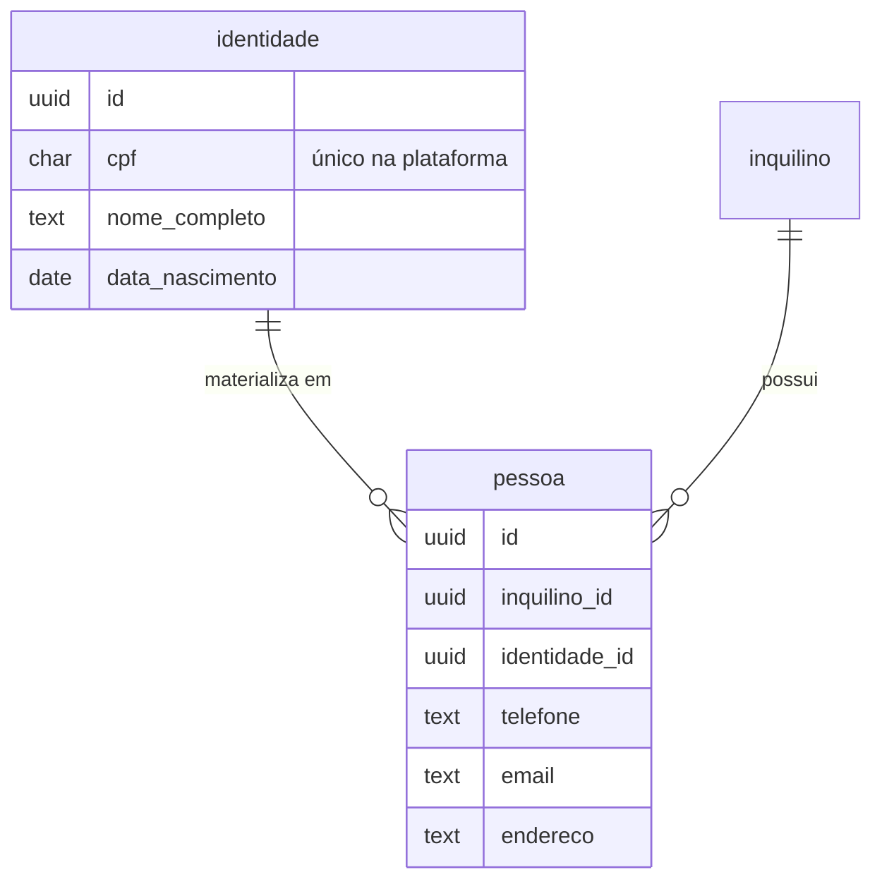
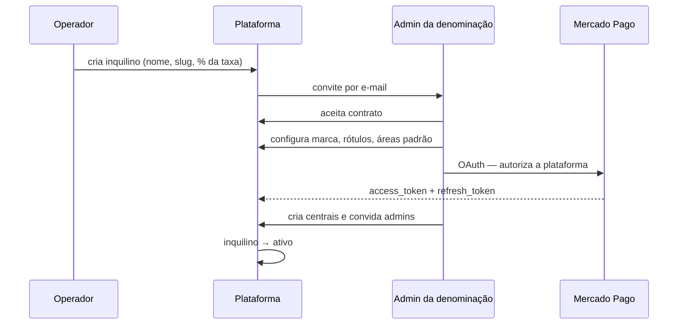

# 00 — Arquitetura multi-inquilino

Fundação da plataforma. Tudo nos outros documentos pressupõe o que está aqui.

## 1. Hierarquia

```
Inquilino (denominação)      Homens de Fé · Homens Adoradores · Tabor
  └── Central (cidade/UF)    Cascavel-PR · Maringá-PR
        └── Encontro         2º Encontro Homens de Fé de Cascavel-PR
              └── Inscrição
                    └── Cobrança
```

Fora da hierarquia, deliberadamente:

```
Identidade (global)   CPF + nome — reconhece a pessoa em qualquer inquilino
  └── Pessoa          um cadastro por inquilino, com PII e dado sensível
```

**RN-050t** — `inquilino_id` é a **primeira** coluna de toda tabela de domínio, inclusive nas que poderiam derivá-lo por join. Denormalização deliberada: política de RLS com join é cara e frágil, e este é o filtro mais executado do sistema.

**RN-051t** — `central_id` acompanha `inquilino_id` em toda tabela abaixo de central. Trigger valida que a central pertence ao inquilino informado, impedindo linha com combinação impossível.

---

## 2. Modelo de isolamento

Schema único, `inquilino_id` em tudo, RLS no Postgres. Duas fronteiras:

| Fronteira | Quem atravessa | Como |
|---|---|---|
| **Inquilino** | ninguém | nenhum papel, em nenhuma hipótese |
| **Central** | admin da denominação | política de RLS por papel |

**RN-052t** — Não existe papel que leia dado de participante de dois inquilinos. Nem o operador. Suporte que precise ver dado real usa acesso temporário concedido pelo admin da denominação (seção 7).

### 2.1 Por que não `where` no código

A API conectando com `service_role` **desliga a RLS**, e o isolamento passa a depender de o dev lembrar do filtro em toda query. Uma query esquecida vaza a plataforma inteira — não uma central, mas todas as denominações.

Com RLS, a query esquecida retorna **zero linhas**. Falha fechada.

### 2.2 Contexto por transação

Role `app_api`, sem `BYPASSRLS`. A cada requisição, dentro da transação:

```sql
set local app.inquilino_id = '...';
set local app.central_id   = '...';   -- nulo para admin da denominação
set local app.pessoa_id    = '...';
set local app.papel        = 'coordenador_encontro';
```

**RN-053t** — `set local`, nunca `set`. Com pool de conexões, `set` vaza o contexto de um inquilino para a requisição seguinte, que pega a mesma conexão. É a falha mais provável desta arquitetura, e a mais grave.

**RN-054t** — O contexto é aplicado por interceptor do NestJS que abre a transação, e nenhum repositório obtém conexão fora dele. Query executada fora do interceptor não tem contexto e, por RN-056t, não retorna nada.

**RN-055t** — Ao devolver a conexão ao pool, executa `discard all` ou o `reset` equivalente. Cinto e suspensório sobre RN-053t.

### 2.3 Política padrão

```sql
alter table inscricao enable row level security;
alter table inscricao force row level security;

-- fronteira do inquilino: sem exceção
create policy inscricao_inquilino on inscricao
  as restrictive
  for all
  using (inquilino_id = nullif(current_setting('app.inquilino_id', true), '')::uuid)
  with check (inquilino_id = nullif(current_setting('app.inquilino_id', true), '')::uuid);

-- fronteira da central: admin da denominação atravessa
create policy inscricao_central on inscricao
  as permissive
  for all
  using (
    current_setting('app.papel', true) in ('admin_denominacao')
    or central_id = nullif(current_setting('app.central_id', true), '')::uuid
  )
  with check (
    current_setting('app.papel', true) in ('admin_denominacao')
    or central_id = nullif(current_setting('app.central_id', true), '')::uuid
  );
```

**RN-056t** — A política do inquilino é `restrictive`, não `permissive`. Políticas permissivas se somam com `OR`; uma política nova mal escrita poderia abrir o que a outra fecha. Restritiva entra com `AND` e não tem como ser contornada por adição.

**RN-057t** — `force row level security` é obrigatório. Sem ele, o owner da tabela ignora as políticas — e em migration é comum rodar como owner.

**RN-058t** — `nullif(..., '')` faz sessão sem contexto retornar zero linhas em vez de erro de cast. Falha fechada, e sem mensagem que revele estrutura.

---

## 3. Resolução do inquilino

Pelo host, antes de qualquer consulta. **Não existe rota administrativa neutra**: toda rota, autenticada ou não, resolve o inquilino pelo host primeiro (RNF-006) — a área administrativa de um inquilino vive no subdomínio ou domínio próprio dele, nunca numa rota como `app.com.br/admin`.

```
homens-de-fe.app.com.br        → inquilino por subdomínio
retiros.homensdefe.org.br      → inquilino por domínio próprio verificado
operador.app.com.br            → área do operador — não pertence a inquilino nenhum (RN-111)
```

O terceiro host é reconhecido **antes** de aplicar o predicado de tenant, sem `inquilino_id` nenhum no contexto de transação — o operador é a única conta que vive fora de um inquilino (RN-004, RN-017).

**RN-059t** — Área pública resolve o inquilino **exclusivamente** pelo host. Nunca por parâmetro de query, cabeçalho customizado ou corpo da requisição — qualquer um deles é escolhido pelo cliente e vira porta de travessia entre inquilinos.

**RN-060t (§8.1)** — Área autenticada resolve o inquilino pelo host, como qualquer rota, e **valida** o vínculo do usuário (`usuario.inquilino_id`) **contra** o host já resolvido — não resolve o inquilino a partir do vínculo. Divergência é `403` e alerta de segurança: ou é bug, ou é tentativa.

**RN-061t** — Só cai na página neutra de "endereço não encontrado" o host que não bater com nenhum dos três reconhecidos — subdomínio curinga, domínio próprio verificado, ou o host do operador. A página neutra não lista inquilinos existentes e não revela que a plataforma é multi-inquilino. A lista de `Access-Control-Allow-Origin` segue os mesmos três: os dois primeiros como lista dinâmica de domínios de inquilino, o host do operador como entrada fixa própria.

**RN-062t (RNF-006)** — Domínio próprio só entra em operação depois de verificação por **CNAME (ou registro equivalente) apontado para a plataforma**. Sem isso, alguém aponta um domínio para a plataforma e serve conteúdo de terceiro na cara de outra denominação.

**RN-063t** — Inquilino `suspenso`: área pública em leitura, inscrição bloqueada com mensagem orientando procurar a coordenação. Inquilino `encerrado`: host devolve o mesmo que host desconhecido. **Dado nunca é apagado por mudança de situação.**

---

## 4. Identidade global × pessoa do inquilino

Esta separação é o que permite reconhecer a pessoa entre denominações sem compartilhar dado entre controladores distintos.



| Guarda | Identidade (global) | Pessoa (por inquilino) |
|---|---|---|
| CPF | sim | não — chega pela identidade |
| Nome | sim | sim, como o inquilino o registrou |
| Telefone, e-mail, endereço | **não** | sim |
| Restrição alimentar, saúde | **não** | sim, em tabela separada |
| Histórico de inscrições | **não** | sim |

**RN-064t** — Ao receber uma ficha, o sistema localiza a identidade pelo CPF. Existindo identidade mas não havendo pessoa neste inquilino, cria a pessoa **do zero**, com o que veio na ficha. **Nada é copiado de outro inquilino** — nem telefone, nem endereço, nem nome.

**RN-065t** — A existência da identidade **não é revelada** ao inquilino. A ficha não autopreenche, não sugere e não informa "já cadastrado". A resposta da API é idêntica havendo ou não identidade prévia. Autopreencher entregaria a uma denominação o telefone que a pessoa deu a outra.

**RN-066t** — Divergência de nome entre a ficha e a identidade global não bloqueia nem corrige nada. A identidade guarda o nome do primeiro cadastro; cada inquilino guarda o seu. Pessoas mudam de nome, e cruzar isso entre organizações é vazamento disfarçado de qualidade de dado.

**RN-067t** — `identidade` **não tem RLS por inquilino** — é global por definição. Em compensação, é acessível apenas por função `security definer` que responde exclusivamente "qual o id da identidade para este CPF", nunca `select` livre. Nenhum papel de aplicação tem `select` direto na tabela.

**RN-068t** — CPF na identidade é armazenado em claro (é necessário para busca exata) **e** indexado por hash para as consultas. A tabela é auditada em todo acesso de escrita.

---

## 5. Marca e rótulos

### 5.1 Rótulos

Chaves fixas no código, valores por inquilino:

```json
{
  "encontro": { "singular": "Encontro", "plural": "Encontros" },
  "participante": { "singular": "Encontrista", "plural": "Encontristas" },
  "servo": { "singular": "Obreiro", "plural": "Obreiros" },
  "grupo": { "singular": "Tribo", "plural": "Tribos" },
  "area_servicao": { "singular": "Ministério", "plural": "Ministérios" },
  "central": { "singular": "Central", "plural": "Centrais" }
}
```

**RN-069t** — Rótulo é **exibição**, nunca identificador. Enum, coluna, rota e chave de API continuam `participante` e `servo` em qualquer inquilino. Traduzir o domínio no banco tornaria impossível consultar a plataforma inteira e quebraria a migração de qualquer inquilino que renomeie um conceito.

**RN-070t** — Toda saída textual gerada pelo sistema aplica os rótulos: tela, e-mail, PDF, mensagem de erro voltada ao usuário. Rótulo ausente cai no padrão da plataforma.

**RN-071t** — Rótulos são resolvidos no servidor e entregues junto com o contexto do inquilino, numa requisição só. O front não busca rótulo por chave sob demanda.

### 5.2 Identidade visual

`logo_url`, `logo_horizontal_url`, `favicon_url`, `cor_primaria`, `cor_secundaria`, `cor_texto_sobre_primaria`.

**RN-072t** — Cores entram como tokens CSS no SSR, não como classe compilada. Cada inquilino tem sua cor sem rebuild.

**RN-073t** — `cor_texto_sobre_primaria` é campo explícito, não calculado. Contraste automático erra em cor de marca e produz botão ilegível — e a denominação vai reclamar da cor, não do algoritmo.

**RN-074t** — Upload de logo é validado por tipo real (magic bytes), não por extensão, redimensionado no servidor e servido do Storage. SVG é convertido para PNG: SVG carrega script.

---

## 6. Onboarding (F0)



**RN-075t** — `slug` é imutável depois de ativo. É subdomínio, está em link compartilhado em grupo de WhatsApp e em e-mail já enviado. Mudança exige intervenção do operador com redirecionamento do slug antigo.

**RN-076t** — A transição para `ativo` exige contrato aceito, marca definida e recebimento conectado (RN-015). Subdomínio no ar sem recebimento faz a primeira inscrição falhar no pagamento — o pior primeiro contato possível.

**RN-077t** — O aceite do contrato grava versão, data, hora, IP e o usuário que aceitou. É a base da relação controlador/operador da LGPD.

---

## 7. Acesso de suporte

**RN-078t** — O operador **não** tem acesso a dado pessoal (RN-005). Para suporte que exija ver dado real, o admin da denominação concede acesso temporário: motivo obrigatório, prazo máximo de 24h, revogável a qualquer momento.

**RN-079t** — Durante o acesso concedido, **toda** consulta do operador é registrada em auditoria — inclusive leitura. O admin da denominação vê o registro em tela própria.

**RN-080t** — Acesso de suporte não alcança `pessoa_dado_sensivel` em hipótese alguma. Problema que exija ver condição de saúde é resolvido pela coordenação, com o operador orientando por descrição.

**RN-081t** — Acesso de suporte expirado é revogado por rotina, não por confiança na sessão.

---

## 8. Faturamento da plataforma

Detalhado em [03-cobranca.md](03-cobranca.md#7-split-e-taxa-da-plataforma). Aqui, o essencial:

**RN-082t** — O dinheiro **não passa pela conta do operador**. O pagamento é criado em nome da conta conectada do inquilino, e a plataforma retém a tarifa de aplicação no próprio split do gateway. Isso evita que o operador figure como intermediário financeiro dos valores da denominação.

**RN-083t** — `taxa_plataforma` é calculada e congelada na criação da cobrança (RN-043). Recalcular no fechamento produziria divergência entre o extrato do gateway e o nosso.

**RN-084t** — Estorno devolve a tarifa proporcionalmente (RN-097).

**RN-085t (RN-018, RN-007)** — Inadimplência **não** derruba encontro em andamento — decisão nº 7 de §11 do PRD, **fechada**: RN-018 (§4.15, "O que não revoga conta") decide que a conta de quem opera o encontro em andamento continua ativa durante a suspensão do inquilino, confirmando de forma independente a mesma decisão desta regra. Suspensão bloqueia novas inscrições e a alteração de configuração do inquilino e das centrais, e preserva a operação do que já está confirmado — a secretaria continua dando baixa manual, a coordenação continua promovendo da fila e resolvendo pendência financeira, a recepção continua fazendo check-in. Derrubar a recepção na sexta à noite destrói a relação com a denominação por uma questão que se resolve na segunda.

---

## 9. Teste

Estes são os testes que impedem o defeito que encerra o produto.

1. **Travessia por id** — coordenador do inquilino A busca inscrição do inquilino B pelo id: `404`.
2. **Travessia por host** — requisição no host do inquilino A com token do inquilino B: `403` e alerta.
3. **Varredura de tabelas** — para cada tabela de domínio, sessão com contexto do inquilino A conta linhas do inquilino B: zero. Roda no CI e falha o build.
4. **Sem contexto** — sessão sem `app.inquilino_id` retorna zero linhas em toda tabela; nunca erro que revele estrutura.
5. **Vazamento de pool** — requisições alternadas entre inquilinos na mesma conexão física: nenhuma enxerga a anterior (RN-053t).
6. **Política restritiva** — política permissiva mal escrita adicionada em teste não consegue abrir a fronteira do inquilino (RN-056t).
7. **Identidade não vaza** — pessoa cadastrada na Tabor se inscreve na Homens de Fé: a ficha não autopreenche, a resposta é idêntica à de um CPF novo, e nenhum dado da Tabor aparece (RN-065t).
8. **Identidade compartilhada** — o mesmo CPF em dois inquilinos aponta para a mesma identidade e para pessoas distintas.
9. **Exclusão LGPD** — exclusão pedida no inquilino A não afeta o cadastro no inquilino B; a identidade só some quando não resta nenhuma pessoa (RN-099).
10. **Slug e numeração** — dois inquilinos com central de mesmo slug e encontros de mesmo número coexistem sem conflito.
11. **Suspensão** — inquilino suspenso bloqueia inscrição, mantém consulta e não apaga nada.
12. **Acesso de suporte** — operador sem concessão recebe `403` em dado pessoal; com concessão, lê e cada leitura é auditada; após expirar, `403` de novo.
13. **Rótulos** — inquilino que chama servo de "obreiro" vê "obreiro" em tela, e-mail e PDF, enquanto a API continua respondendo `"tipo": "servo"`.
14. **Cobertura da RN-051t** — para cada tabela com o par `inquilino_id` + `central_id`, o trigger de validação está pendurado, **sem exceção**: as sete, `auditoria` incluída. Escrita que aponte para central de outro inquilino — ou que traga central sem inquilino — é recusada no banco, não só na aplicação. `auditoria` não tem FK de propósito (é log polimórfico, §4.7 de 01-modelo-de-dados.md) e por isso ficou de fora até a 0006, sob o argumento de que o log precisaria sobreviver à exclusão da central; central não é apagada — usa `ativa` —, e sob RLS tolerar "central não encontrada" seria aceitar em silêncio a central de outro inquilino, que é o que esta regra existe para barrar.
