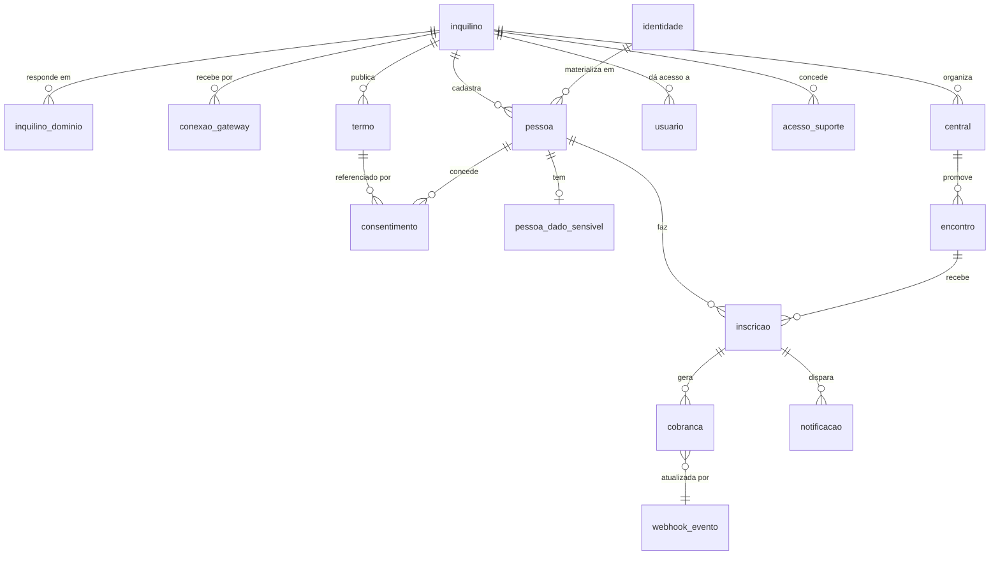

# 01 — Modelo de dados

Estratégia de isolamento, contexto de sessão e políticas de RLS estão em [00-multi-inquilino.md](00-multi-inquilino.md). Aqui está o schema.

## 1. Tipos

```sql
create type situacao_inquilino as enum (
  'em_implantacao', 'ativo', 'suspenso', 'encerrado'
);

create type situacao_encontro as enum (
  'rascunho', 'publicado', 'inscricoes_encerradas',
  'em_andamento', 'encerrado', 'cancelado'
);

create type tipo_inscricao as enum ('participante', 'servo');

create type situacao_inscricao as enum (
  'lista_espera', 'pendente_pagamento', 'confirmada',
  'presente', 'ausente', 'cancelada'
);

create type metodo_pagamento as enum ('pix', 'cartao_credito', 'dinheiro', 'pix_presencial');

create type situacao_cobranca as enum (
  'pendente_emissao', 'criada', 'aguardando_pagamento', 'em_analise', 'paga',
  'recusada', 'expirada', 'cancelada',
  'estornada_parcial', 'estornada'
);

create type papel_usuario as enum (
  'servo', 'admin_central', 'admin_denominacao', 'operador'
);
```

`metodo_pagamento.dinheiro` e `.pix_presencial` (RN-040) cobrem RN-070 (secretaria recebe na hora do check-in). Entram já na fase 1 porque a coluna faz parte da prestação de contas. `situacao_cobranca.pendente_emissao` (RN-098) é o estado de nascença quando a inscrição foi aceita mas a plataforma não conseguiu emitir a cobrança no gateway por indisponibilidade de recebimento — situação própria, não ausência de cobrança.

`papel_usuario` (RN-017) grava só os **quatro** papéis de escopo largo que são conta: `inscrito` não existe como papel de conta — o inscrito não tem conta, usa `token_consulta` (RN-019); `coordenador_area` e `coordenador_encontro` não são papel gravado — são **derivados** dos ponteiros de coordenação (RN-025, RN-046), porque são papéis de um encontro, não de uma pessoa.

---

## 2. Plataforma

### 2.1 `inquilino`

```sql
create table inquilino (
  id                    uuid primary key,
  nome                  text not null,
  slug                  text not null unique,
  situacao              situacao_inquilino not null default 'em_implantacao',

  -- identidade visual
  logo_url              text,
  logo_horizontal_url   text,
  favicon_url           text,
  cor_primaria          text not null default '#1f2937',
  cor_secundaria        text not null default '#6b7280',
  cor_texto_sobre_primaria text not null default '#ffffff',

  -- rótulos (RN-008, RN-069t)
  rotulos               jsonb not null default '{}',

  -- áreas de servição padrão herdadas pelas centrais (RN-047a)
  areas_padrao          jsonb not null default '[]',

  -- plataforma
  taxa_plataforma_percentual numeric(5,3) not null default 0
                        check (taxa_plataforma_percentual between 0 and 100),
  taxa_repassada_ao_inscrito boolean not null default false,

  -- contrato
  contrato_versao       text,
  contrato_aceito_em    timestamptz,
  contrato_aceito_por   uuid,
  contrato_aceito_ip    inet,

  criado_em             timestamptz not null default now(),
  atualizado_em         timestamptz not null default now(),

  constraint inquilino_slug_formato check (slug ~ '^[a-z0-9]+(-[a-z0-9]+)*$'),
  constraint inquilino_ativo_tem_contrato check (
    situacao = 'em_implantacao' or contrato_aceito_em is not null
  )
);
```

`inquilino_ativo_tem_contrato` implementa parte de RN-076t no banco. A parte de recebimento conectado é validada na aplicação, porque depende de outra tabela.

`taxa_plataforma_percentual` com 3 casas decimais: 2,5% se escreve `2.500`.

### 2.2 `inquilino_dominio`

```sql
create table inquilino_dominio (
  id                uuid primary key,
  inquilino_id      uuid not null references inquilino(id),
  dominio           text not null unique,
  tipo              text not null,        -- subdominio | proprio
  verificado        boolean not null default false,
  token_verificacao text,
  verificado_em     timestamptz,
  principal         boolean not null default false,
  criado_em         timestamptz not null default now()
);

create unique index inquilino_dominio_principal_unico
  on inquilino_dominio (inquilino_id) where principal;
```

Tabela separada porque um inquilino tem o subdomínio da plataforma **e** pode ter domínio próprio, com o slug antigo continuando a responder depois de uma troca (RN-075t).

**RN-120** — A resolução por host consulta esta tabela com `verificado = true`. Domínio não verificado existe no cadastro e não serve tráfego (RNF-006, RN-062t) — até a verificação passar, o subdomínio continua sendo o endereço válido.

### 2.3 `conexao_gateway`

```sql
create table conexao_gateway (
  id                  uuid primary key,
  inquilino_id        uuid not null references inquilino(id),
  central_id          uuid references central(id),
  gateway             text not null default 'mercadopago',
  conta_externa_id    text not null,
  access_token_ref    text not null,
  refresh_token_ref   text not null,
  expira_em           timestamptz not null,
  escopos             text[],
  ativa               boolean not null default true,
  ultimo_refresh_em   timestamptz,
  falhas_refresh      smallint not null default 0,
  conectada_por       uuid not null,
  conectada_em        timestamptz not null default now(),
  desativada_em       timestamptz,
  motivo_desativacao  text,
  criado_em           timestamptz not null default now(),

  constraint conexao_gateway_unica unique (inquilino_id, central_id, gateway)
);
```

`central_id` nulo = conexão do inquilino inteiro; preenchido = conexão daquela central. É o formato definitivo da decisão nº 2 de §11 do PRD (**fechada**): o inquilino conecta por padrão, e a central com conta distinta conecta a própria, a qualquer momento, sobrepondo o padrão só para ela — a resolução de uma cobrança procura primeiro a da central e, não achando, a do inquilino. Reconectar substitui a anterior no mesmo ato — a linha antiga fica `ativa = false` com `desativada_em`, e **não é apagada**, porque cobrança emitida por ela continua viva no gateway e o webhook dela continua chegando. `motivo_desativacao` distingue as três desativações que se parecem na tela e se resolvem de formas diferentes: `falha_renovacao` (costuma voltar sozinha), `revogada_no_gateway` (exige reconectar) e `desconectada_pelo_inquilino` (foi alguém decidindo) — a troca deliberada de conexão pelo admin da central também passa por aqui, como `desconectada_pelo_inquilino`.

**RN-121 (RN-104)** — `access_token_ref` e `refresh_token_ref` guardam o **nome do secret** no cofre (Supabase Vault / Railway), nunca o token. Token de OAuth em tabela de aplicação é credencial de movimentar dinheiro alheio em texto legível. Ninguém lê o token pela aplicação, nem o operador — quem o usa é a chamada ao gateway, que o busca no cofre no ato.

**RN-122 (RN-104, RN-105)** — Rotina diária renova todo token com menos de 15 dias para expirar. Renovação falhada incrementa `falhas_refresh` e alerta operador e admin da denominação. Na terceira falha, marca `ativa = false`, grava `motivo_desativacao = falha_renovacao` e bloqueia **emissão de cobrança nova** — não cobrança já emitida, que continua pagável — **antes** de o inscrito descobrir na hora de pagar (RN-098). Quem conecta é admin da denominação (conexão do inquilino) ou admin da central (conexão da central); o operador não conecta recebimento de ninguém.

**RN-123 (RN-098, RN-105)** — A resolução da conexão para uma cobrança busca primeiro a da central; não achando, a do inquilino. Não achando nenhuma ativa, a cobrança **não falha**: nasce em `pendente_emissao`, a inscrição é aceita e ocupa vaga normalmente — nunca se cria cobrança que não tem para onde mandar o dinheiro, e nunca se recusa a inscrição por uma falha nossa.

### 2.4 `acesso_suporte`

```sql
create table acesso_suporte (
  id              uuid primary key,
  inquilino_id    uuid not null references inquilino(id),
  operador_id     uuid not null,
  concedido_por   uuid not null,
  motivo          text not null,
  expira_em       timestamptz not null,
  revogado_em     timestamptz,
  criado_em       timestamptz not null default now(),

  constraint acesso_suporte_prazo_maximo check (
    expira_em <= criado_em + interval '24 hours'
  )
);
```

Implementa RN-078t a RN-081t. O prazo máximo é constraint de banco, não validação de aplicação.

---

## 3. Pessoas

### 3.1 `identidade`

Global, fora do isolamento por inquilino. É a única tabela assim, e por isso a mais protegida.

```sql
create table identidade (
  id              uuid primary key,
  cpf             char(11) not null unique,
  cpf_hash        bytea not null,
  nome_completo   text not null,
  data_nascimento date not null,
  criado_em       timestamptz not null default now(),
  atualizado_em   timestamptz not null default now()
);

create index on identidade (cpf_hash);

revoke all on identidade from app_api, app_publico;
```

**RN-124 (RN-001)** — Nenhum role de aplicação tem `select` nesta tabela (RN-067t). O único acesso é pela função abaixo, chamada só depois de o CPF ser **normalizado** (11 dígitos, preservando zero à esquerda) e **validado** (dígitos verificadores, recusa das dez sequências de dígito repetido) pela camada de aplicação (RN-010a) — CPF que não fecha não chega a esta função:

```sql
create function resolver_identidade(
  p_cpf char(11), p_nome text, p_nascimento date
) returns uuid
language plpgsql security definer
as $$
declare v_id uuid;
begin
  select id into v_id from identidade where cpf = p_cpf;
  if v_id is null then
    insert into identidade (id, cpf, cpf_hash, nome_completo, data_nascimento)
    values (gen_random_uuid(), p_cpf, digest(p_cpf, 'sha256'), p_nome, p_nascimento)
    returning id into v_id;
  end if;
  return v_id;
end $$;
```

Ela devolve **um uuid e nada mais**. Não devolve nome, não diz se já existia, não indica em quantos inquilinos a pessoa aparece. É o que implementa RN-065t na camada mais baixa possível: mesmo um bug na aplicação não tem como vazar o que a função não retorna. Pessoa **sem CPF** (RN-010b) não passa por esta função: nasce sem identidade, `identidade_id` vazio em `pessoa`, cadastrada só pela via administrativa (papel mínimo coordenador do encontro, justificativa obrigatória).

**RN-125 (RN-011a)** — `resolver_identidade` nunca atualiza nome ou nascimento de identidade existente (RN-066t). O primeiro cadastro fixa o valor; cada inquilino guarda a sua versão em `pessoa`. Divergência entre as duas versões é esperada, não erro.

### 3.2 `pessoa`

```sql
create table pessoa (
  id                        uuid primary key,
  inquilino_id              uuid not null references inquilino(id),
  identidade_id             uuid references identidade(id),
  central_origem_id         uuid references central(id),
  nome_completo             text not null,
  nome_cracha               text not null,
  data_nascimento           date not null,
  telefone                  text not null,
  email                     text not null,
  cep                       char(8),
  logradouro                text,
  numero                    text,
  complemento               text,
  bairro                    text,
  cidade                    text,
  uf                        char(2),
  estado_civil              text,
  contato_emergencia_nome   text not null,
  contato_emergencia_fone   text not null,
  observacoes               text,
  anonimizada_em            timestamptz,
  criado_em                 timestamptz not null default now(),
  atualizado_em             timestamptz not null default now(),

  constraint pessoa_unica_por_inquilino unique (inquilino_id, identidade_id)
);

create index on pessoa (inquilino_id, nome_completo);
```

`pessoa_unica_por_inquilino` implementa RN-012, e não alcança pessoa com `identidade_id` vazio: divergência de CPF entre duas pessoas sem CPF não é duplicata. Repare que **não há coluna `cpf`**: o CPF vive só na identidade. Consulta por CPF passa por `resolver_identidade` e depois busca a pessoa pelo `identidade_id` dentro do inquilino.

`identidade_id` é **nullable** e fica vazio em três casos: a pessoa sem CPF (RN-010b), a pessoa anonimizada pelo pedido de exclusão do titular (RN-092b) e a pessoa anonimizada por idade (RN-093) — os dois últimos esvaziam o ponteiro no mesmo ato da anonimização. Nenhuma constraint restringe o `null` só ao caso sem CPF: a rotina de exclusão esvazia o mesmo ponteiro. `anonimizada_em` é o carimbo que as duas anonimizações gravam — a linha continua existindo, com marcadores no lugar do dado pessoal, porque a inscrição e a cobrança dela continuam existindo.

**RN-126 (RN-014)** — A pessoa é do inquilino, não da central. `central_origem_id` é informativo e não participa de nenhuma política de RLS. Restringir pessoa por central impediria que alguém de Cascavel servisse em Maringá — que é o caso de uso que motivou a decisão.

### 3.3 `pessoa_dado_sensivel`

```sql
create table pessoa_dado_sensivel (
  pessoa_id                 uuid primary key references pessoa(id) on delete cascade,
  inquilino_id              uuid not null references inquilino(id),
  restricao_alimentar       text,
  condicao_saude            text,
  medicamentos_uso_continuo text,
  religiao_declarada        text,
  criado_em                 timestamptz not null default now(),
  atualizado_em             timestamptz not null default now()
);
```

Sem `plano_saude`: não é campo que RN-091a declara, e não entra nesta tabela.

**RN-127 (RN-091a)** — Nenhuma view, exportação ou listagem geral faz join com esta tabela — só três exceções nomeadas: a lista consolidada da cozinha (`restricao_alimentar`, com nome e grupo) e o relatório restrito de saúde (`condicao_saude`, `medicamentos_uso_continuo`), cada um auditado por **emissão**, não por pessoa listada; e a exportação do titular (RN-092a), coberta pelo registro do próprio pedido. Fora dessas três, acesso é só por endpoint dedicado, um registro por vez, com cada **leitura** auditada — não só escrita. A visibilidade é **por campo**: `restricao_alimentar` para coordenação do encontro, admin da central e servos da área com `papel = cozinha` (RN-047a); `condicao_saude` e `medicamentos_uso_continuo` para coordenação, admin da central e servos da área com `papel = saude`; `religiao_declarada` só para coordenação do encontro e admin da central, sem relatório nem lista nenhuma. O acesso por área exige inscrição de servo viva naquela área e naquele encontro, e termina quando o encontro passa a `encerrado`.

**RN-128 (RN-091a, RN-005a)** — Acesso de suporte (`acesso_suporte`) **não** alcança esta tabela em hipótese alguma, com ou sem concessão. A política de RLS exclui o papel `operador` explicitamente, sem exceção por concessão.

### 3.4 `termo` (RN-090a)

Versão do termo de uso e consentimento de dados publicada por um inquilino.

```sql
create table termo (
  id                    uuid primary key,
  inquilino_id          uuid not null references inquilino(id),
  versao                text not null,
  titulo                text not null,
  corpo                 text not null,
  finalidades           text[] not null,
  controlador_nome      text not null,
  controlador_documento text not null,
  encarregado_nome      text not null,
  encarregado_contato   text not null,
  situacao              text not null default 'rascunho', -- rascunho | vigente | substituida
  publicado_por         uuid,
  publicado_em          timestamptz,
  substituida_em        timestamptz
);

create unique index termo_vigente_unico
  on termo (inquilino_id)
  where situacao = 'vigente';
```

Uma versão `vigente` por inquilino; publicar uma nova passa a anterior a `substituida`. Versão publicada é **imutável** — corrigir uma vírgula é publicar versão nova, porque o consentimento gravado aponta para a versão e mexer no texto por baixo dele transforma o registro numa afirmação falsa sobre o que a pessoa leu. Sem termo `vigente` não há inscrição (RN-015).

### 3.5 `consentimento` (RN-090b)

```sql
create table consentimento (
  id            uuid primary key,
  inquilino_id  uuid not null references inquilino(id),
  pessoa_id     uuid not null references pessoa(id),
  inscricao_id  uuid references inscricao(id),
  termo_id      uuid not null references termo(id),
  versao_termo  text not null,
  finalidades   text[] not null,
  aceito_em     timestamptz not null,
  ip            inet not null,
  user_agent    text,
  origem        text not null, -- site_publico | area_administrativa
  revogado_em   timestamptz,
  revogado_motivo text
);
```

Um registro por **ato de aceite**, não uma caixinha marcada na pessoa: imutável, exceto pela revogação — revogar grava `revogado_em`/`revogado_motivo` na própria linha, e consentir de novo cria linha nova. `versao_termo` é **cópia** de `termo.versao`, ao lado do ponteiro `termo_id`, e sobrevive a qualquer coisa que aconteça com o termo. `origem` não é decoração: o `ip` de um consentimento de origem `area_administrativa` é de quem registrou, não do titular.

O consentimento de **retenção** (RN-093a) é registro **próprio** desta tabela — linha separada, com seu próprio `aceito_em` e sua própria revogação —, e não uma finalidade dentro da linha do consentimento obrigatório: revogar por linha revogaria junto as finalidades de que a inscrição depende.

**RN-129 (RN-090a)** — O termo é do inquilino, que é o controlador (PRD §9). `versao_termo` referencia o termo daquele inquilino, não um texto único da plataforma — publicar é ato do admin da denominação, e só dele.

---

## 4. Domínio

### 4.1 `central`

```sql
create table central (
  id                  uuid primary key,
  inquilino_id        uuid not null references inquilino(id),
  nome                text not null,
  cidade              text not null,
  uf                  char(2) not null,
  slug                text not null,
  logo_url            text,
  email_contato       text,
  telefone_contato    text,
  ativa               boolean not null default true,

  parcela_minima      numeric(10,2) not null default 50.00,
  max_parcelas        smallint not null default 12
                      check (max_parcelas between 1 and 12),

  reembolso_faixas    jsonb not null default
                      '[{"antecedencia_minima_dias":16,"percentual":100},{"antecedencia_minima_dias":7,"percentual":50},{"antecedencia_minima_dias":0,"percentual":0}]',

  despesa_exige_comprovante_acima_de numeric(10,2) not null default 0.00,

  criado_em           timestamptz not null default now(),
  atualizado_em       timestamptz not null default now(),

  constraint central_slug_unico_por_inquilino unique (inquilino_id, slug)
);
```

`central_slug_unico_por_inquilino` implementa RN-009: duas denominações podem ter, cada uma, sua `cascavel-pr`.

`reembolso_faixas` é lista ordenada por `antecedencia_minima_dias` decrescente; aplica-se a primeira faixa cujo `antecedencia_minima_dias` seja menor ou igual à antecedência do cancelamento; antecedência negativa cai na última faixa (RN-065). **A primeira faixa é 16, não 15**: a RN-060 abre a faixa de 100% em `> 15` dias, e 15 dias exatos devolvem 50% — escrever 15 aqui devolve 100% onde a regra manda pagar pela metade. Invariantes: `antecedencia_minima_dias` inteiros não negativos sem repetição, última faixa em 0, `percentual` entre 0 e 100 e não crescente conforme a antecedência diminui.

`despesa_exige_comprovante_acima_de` (RN-049a) tem padrão **R$ 0,00** — todo lançamento exige comprovante até que alguém decida o contrário; é lido no ato do lançamento, não congelado, e baixar o valor não invalida despesa já aprovada.

**RN-130 (RN-103)** — A central herda `reembolso_faixas`, `parcela_minima`, `max_parcelas` e `despesa_exige_comprovante_acima_de` do inquilino na criação, e pode sobrescrever. Herança é **cópia** no momento da criação, não referência: mudar a política da denominação não altera retroativamente a de centrais existentes, cujos encontros já foram divulgados com aquela regra. Propagar um padrão novo às centrais que já existem exige ato explícito do admin da denominação, com confirmação, motivo e auditoria — nunca efeito colateral de editar a configuração do inquilino.

### 4.2 `encontro`

```sql
create table encontro (
  id                    uuid primary key,
  inquilino_id          uuid not null references inquilino(id),
  central_id            uuid not null references central(id),
  numero                integer not null,
  titulo                text not null,
  slug                  text not null,
  data_inicio           date not null,
  data_fim              date not null,
  local_nome            text not null,
  local_endereco        text not null,
  local_cidade          text not null,
  local_uf              char(2) not null,
  vagas_participantes   smallint not null check (vagas_participantes > 0),
  vagas_servos          smallint not null check (vagas_servos > 0),
  taxa_participante     numeric(10,2) not null check (taxa_participante >= 0),
  taxa_servo            numeric(10,2) not null check (taxa_servo >= 0),
  inscricoes_abrem_em   timestamptz not null,
  inscricoes_fecham_em  timestamptz not null,
  situacao              situacao_encontro not null default 'rascunho',
  motivo_cancelamento   text,
  coordenador_inscricao_id uuid references inscricao(id),
  texto_divulgacao      text,
  imagem_capa_url       text,
  criado_em             timestamptz not null default now(),
  atualizado_em         timestamptz not null default now(),

  constraint encontro_numero_unico_por_central unique (central_id, numero),
  constraint encontro_slug_unico_por_central   unique (central_id, slug),
  constraint encontro_datas_coerentes          check (data_fim >= data_inicio),
  constraint encontro_janela_coerente          check (inscricoes_fecham_em > inscricoes_abrem_em)
);
```

`encontro_numero_unico_por_central` implementa RN-020. Como `central_id` é único na plataforma, a numeração fica automaticamente isolada por inquilino — o "2º Encontro" da Homens de Fé de Cascavel e o da Tabor de Cascavel coexistem.

**RN-131 (RN-020)** — `numero` é sugerido por `max(numero) + 1` na central, mas gravado como valor fixo e editável. Não é sequence: o PRD prevê ajuste manual para acomodar edições anteriores ao sistema.

**RN-132 (RN-020, RN-024)** — `titulo` é armazenado formatado (`2º Encontro Homens de Fé de Cascavel-PR`), não montado em exibição. A interface **sugere** o padrão do inquilino na criação, aplicando os rótulos, e o admin pode editar. `slug` é sugerido a partir de `numero` e `titulo`, editável em `rascunho` e **imutável a partir de `publicado`** — a partir daí o link está circulando em grupo de mensagem. É único **dentro da central**, e a URL pública (`/{slug da central}/{slug do encontro}`) nunca expõe o `id`. Encontro `cancelado` ou `encerrado` mantém slug e URL. `coordenador_inscricao_id` aponta para a inscrição de servo que exerce o papel de coordenador do encontro (RN-025); não é condição para criar nem publicar, e é limpo — com alerta no painel do encontro (RN-115) — se a inscrição apontada é cancelada.

**Publicação** — `rascunho → publicado` exige vagas, taxas, janela no futuro, local, texto de divulgação, **e inquilino `ativo` com recebimento conectado**. Falta de qualquer um retorna `422 ENCONTRO_INCOMPLETO` com a lista.

### 4.3 `inscricao`

```sql
create table inscricao (
  id                    uuid primary key,
  inquilino_id          uuid not null references inquilino(id),
  central_id            uuid not null references central(id),
  encontro_id           uuid not null references encontro(id),
  pessoa_id             uuid not null references pessoa(id),
  tipo                  tipo_inscricao not null,
  situacao              situacao_inscricao not null,
  convidador_pessoa_id  uuid references pessoa(id),
  convidador_nome       text,
  area_pretendida       text,
  valor_devido          numeric(10,2) not null check (valor_devido >= 0),
  taxa_plataforma_repassada  boolean not null default false,
  taxa_plataforma_percentual numeric(5,3) not null default 0,
  reembolso_faixas      jsonb not null,
  campos_extras         jsonb not null default '[]',
  token_consulta        text not null unique,
  posicao_espera        integer,
  espera_promovida_em   timestamptz,
  espera_expira_em      timestamptz,
  cancelada_em          timestamptz,
  motivo_cancelamento   text,
  criado_em             timestamptz not null default now(),
  atualizado_em         timestamptz not null default now(),

  constraint inscricao_espera_coerente check (
    (situacao = 'lista_espera') = (posicao_espera is not null)
  )
);

-- RN-031: uma inscrição ativa por pessoa por encontro
create unique index inscricao_ativa_unica
  on inscricao (encontro_id, pessoa_id)
  where situacao <> 'cancelada';

-- fila estável da lista de espera
create unique index inscricao_posicao_espera_unica
  on inscricao (encontro_id, tipo, posicao_espera)
  where situacao = 'lista_espera';

create index on inscricao (encontro_id, situacao, tipo);
create index on inscricao (inquilino_id, criado_em desc);
```

`inscricao_ativa_unica` implementa RN-031 **no banco**. Verificação em código não resolve: duas requisições simultâneas passam pelas duas validações antes de qualquer insert.

`convidador_nome` (RN-039, renomeado de `convidador_nome_livre`) é **sempre** gravado, inclusive com `convidador_pessoa_id` preenchido — a constraint `inscricao_convidador_exclusivo` foi removida, e os dois campos coexistem preenchidos: `convidador_nome` é o que a pessoa digitou, `convidador_pessoa_id` é o único que a RN-045 lê para distribuição de grupos.

`taxa_plataforma_repassada`, `taxa_plataforma_percentual` e `reembolso_faixas` são a **âncora do preço** e da política de cancelamento, congeladas junto com `valor_devido` no ato da criação (RN-038, RN-065, RN-096): a cobrança lê os dois primeiros daqui, nunca do inquilino vigente, e o cálculo do reembolso lê `reembolso_faixas` daqui, nunca da central vigente.

**RN-116** — `campos_extras` é lista de pares `{ "label": "...", "valor": "..." }`, em texto livre, sem tipo próprio, sem validação além do tamanho e sem RLS de dado sensível — não é `pessoa_dado_sensivel` (§3.3) e não entra no acesso restrito da RN-127. Os rótulos possíveis são definidos pelo admin da denominação na configuração do inquilino (mesmo nível de `rotulos`), a ficha grava os valores que a pessoa preencheu, e o bloco aparece como "informações adicionais" na consulta por token e na exportação do titular, sempre separado dos campos fixos. Cobre encontro segmentado (casais, jovens) sem motor de formulário — campo com tipo, validação ou ordem própria fica para quando houver demanda real.

**RN-133 (RN-019)** — `token_consulta` é aleatório de 32 bytes em base64url, sem relação com o `id`, e único na plataforma inteira — não por inquilino. É credencial de acesso sem login: não aparece em log, não vai em query string de redirect, só em corpo de resposta e no link enviado por e-mail. Vale enquanto o encontro não é `encerrado`, inclusive com a inscrição já `cancelada` — é por ele que se acompanha o reembolso —, e é reemitido a pedido do titular ou por decisão da coordenação em caso de vazamento suspeito.

**Campos ausentes de propósito** — `grupo_id`, `area_servicao_id`, `funcao`, `data_checkin` são da fase 2.

### 4.4 `cobranca`

```sql
create table cobranca (
  id                     uuid primary key,
  inquilino_id           uuid not null references inquilino(id),
  central_id             uuid not null references central(id),
  inscricao_id           uuid not null references inscricao(id),
  conexao_gateway_id     uuid references conexao_gateway(id),
  metodo                 metodo_pagamento not null,
  parcelas               smallint not null default 1 check (parcelas between 1 and 12),

  valor                  numeric(10,2) not null check (valor > 0),
  taxa_plataforma        numeric(10,2) not null default 0 check (taxa_plataforma >= 0),
  taxa_plataforma_percentual numeric(5,3) not null default 0,
  valor_liquido          numeric(10,2),
  situacao               situacao_cobranca not null default 'criada',

  gateway                text not null default 'mercadopago',
  gateway_pagamento_id   text,
  idempotency_key        uuid not null,

  pix_qr_code            text,
  pix_qr_code_base64     text,
  link_pagamento         text,

  expira_em              timestamptz,
  pago_em                timestamptz,
  atualizado_em_gateway  timestamptz,
  motivo_recusa          text,

  baixa_manual_por         uuid,
  baixa_manual_em          timestamptz,
  baixa_manual_observacao  text,

  estorno_situacao        text not null default 'nao_solicitado',
    -- nao_solicitado | solicitado | indeterminado | concluido | recusado
  estorno_valor            numeric(10,2) not null default 0 check (estorno_valor >= 0),
  estorno_atualizado_em    timestamptz,
  estorno_tarifa_gateway   numeric(10,2) not null default 0 check (estorno_tarifa_gateway >= 0),
  taxa_estornada           numeric(10,2) not null default 0 check (taxa_estornada >= 0),

  contestacao_situacao      text not null default 'nenhuma',
    -- nenhuma | aberta | perdida | revertida
  contestacao_valor         numeric(10,2),
  contestacao_atualizada_em timestamptz,

  devolucao_presencial_por         uuid,
  devolucao_presencial_em          timestamptz,
  devolucao_presencial_valor       numeric(10,2),
  devolucao_presencial_observacao  text,

  criado_em              timestamptz not null default now(),
  atualizado_em          timestamptz not null default now(),

  constraint cobranca_gateway_id_unico   unique (gateway, gateway_pagamento_id),
  constraint cobranca_idempotency_unica  unique (idempotency_key),
  constraint cobranca_estorno_ate_o_valor check (estorno_valor <= valor),
  constraint cobranca_taxa_ate_o_valor    check (taxa_plataforma <= valor),
  constraint cobranca_parcelas_so_cartao  check (
    metodo = 'cartao_credito' or parcelas = 1
  )
);

create unique index cobranca_viva_unica
  on cobranca (inscricao_id)
  where situacao in ('pendente_emissao', 'criada', 'aguardando_pagamento', 'em_analise');

create index on cobranca (situacao, expira_em)
  where situacao = 'aguardando_pagamento';

create index on cobranca (inquilino_id, pago_em)
  where situacao = 'paga';
```

`cobranca_viva_unica` impede o defeito clássico: usuário clica duas vezes, o sistema gera dois Pix e a pessoa paga os dois.

**RN-134** — `taxa_plataforma_percentual` é copiado da inscrição (não do inquilino vigente) e congelado junto com o valor (RN-043, RN-096, RN-083t). Guardar o percentual além do valor permite auditar o cálculo anos depois, quando o percentual vigente já for outro. `estorno_situacao`, `contestacao_situacao` e os campos de estorno/contestação/devolução acima implementam RN-062 a RN-064, RN-097 e RN-102 — detalhados em [03-cobranca.md](03-cobranca.md).

**RN-143** — `idempotency_key` é gerada **antes** da chamada ao gateway e persistida junto com a cobrança em `criada`. Se a chamada falhar por timeout, o retry usa a mesma chave e o Mercado Pago devolve o pagamento original em vez de criar outro. Gerar a chave depois da resposta não protege de nada.

**RN-144** — Cobrança em `criada` há mais de 15 minutos sem `gateway_pagamento_id` é investigada pela reconciliação pela `idempotency_key` antes de qualquer nova tentativa.

O índice em `(inquilino_id, pago_em)` sustenta a apuração de faturamento da plataforma sem varredura.

### 4.5 `webhook_evento`

```sql
create table webhook_evento (
  id                  uuid primary key,
  inquilino_id        uuid references inquilino(id),
  gateway             text not null default 'mercadopago',
  notificacao_id      text not null,
  tipo                text not null,
  acao                text,
  recurso_id          text not null,
  assinatura_valida   boolean not null,
  corpo_bruto         jsonb not null,
  cabecalhos          jsonb not null,
  recebido_em         timestamptz not null default now(),
  processado_em       timestamptz,
  resultado           text,
  erro                text,
  tentativas          smallint not null default 0,

  constraint webhook_evento_unico unique (gateway, notificacao_id)
);

create index on webhook_evento (recurso_id, recebido_em desc);
create index on webhook_evento (processado_em) where processado_em is null;
```

**RN-135 (RN-053)** — `inquilino_id` é **nullable** e esta é a única tabela de domínio que não tem RLS por inquilino. Motivo: o webhook chega antes de sabermos de quem é, e a rota já identifica o inquilino (RN-405), mas evento órfão pode não ter dono nenhum. O acesso é restrito ao processador e ao operador; a tabela não é exposta em nenhum endpoint de inquilino. Assinatura inválida também é gravada, com `assinatura_valida = false`, e rejeitada em seguida — descartar em silêncio apaga a única evidência de tentativa por fora. `corpo_bruto` e `cabecalhos` carregam dado do pagador vindo do gateway e são apagados **90 dias** depois de `recebido_em`; o resto da linha — identificadores, tipo, resultado e carimbos — fica, e é o que a conciliação (RN-102) e a auditoria usam a partir dali.

### 4.6 `notificacao`

```sql
create table notificacao (
  id            uuid primary key,
  inquilino_id  uuid not null references inquilino(id),
  central_id    uuid references central(id),
  inscricao_id  uuid references inscricao(id),
  pessoa_id     uuid references pessoa(id),
  usuario_id    uuid references usuario(id),
  gatilho       text not null,
  canal         text not null,
  destinatario  text not null,
  chave_unica   text not null,
  situacao      text not null default 'pendente',
  tentativas    smallint not null default 0,
  enviada_em    timestamptz,
  erro          text,
  criado_em     timestamptz not null default now(),

  constraint notificacao_chave_unica unique (chave_unica)
);
```

`pessoa_id` e `usuario_id` cobrem gatilhos sem inscrição associada — convite de acesso (RN-018), versão nova do termo (RN-090a), exportação e exclusão (F10).

**RN-136 (RN-107)** — `chave_unica` = `{gatilho}:{inscricao_id}:{discriminador}`, com `inscricao_id` sendo uuid global. Garante a parte "nem duplica notificação" de RN-050 sem depender de contexto de inquilino. Enviada dentro da transação que a gera e enviada **depois do commit**; falha grava `tentativas`/`erro`, com nova tentativa espaçada e teto, e a notificação em `falha` aparece para a coordenação no painel do encontro.

**RN-137 (RN-107)** — O remetente e a assinatura do e-mail usam a marca e os rótulos do inquilino (RN-070t, RNF-007). Endereço de resposta é o `email_contato` da central que organiza o encontro (herdado por cópia do inquilino — RN-103), ou o do próprio inquilino para notificação sem encontro associado. Um e-mail da plataforma chegando com nome genérico faz o inscrito achar que é golpe.

### 4.7 `auditoria`

```sql
create table auditoria (
  id               uuid primary key,
  inquilino_id     uuid,
  central_id       uuid,
  entidade         text not null,
  entidade_id      uuid not null,
  acao             text not null,
  ator_tipo        text not null,   -- usuario | sistema | webhook | publico | operador
  ator_id          uuid,
  ator_descricao   text,
  motivo           text,
  antes            jsonb,
  depois           jsonb,
  ip               inet,
  user_agent       text,
  criado_em        timestamptz not null default now()
);

create index on auditoria (entidade, entidade_id, criado_em desc);
create index on auditoria (inquilino_id, criado_em desc);
create index on auditoria (ator_tipo, criado_em desc) where ator_tipo = 'operador';
```

`inquilino_id` é opcional aqui pela mesma razão da RNF-001: convite, mudança de papel e revogação de conta `operador` são atos de escopo de plataforma sobre uma conta que vive fora de um inquilino, e ficam com `inquilino_id` vazio. `motivo` é obrigatório onde o documento exige justificativa (criação administrativa, promoção manual, alteração de `valor_devido`, concessão de suporte, mudança de papel, entre outras — RN-106) e vazio no resto. `antes`/`depois` nunca carregam campo de `pessoa_dado_sensivel` nem segredo (token de gateway, `token_consulta`, token de convite) — entram como marcador, nunca como valor.

**RN-138 (RN-106)** — `auditoria` é append-only: `app_api` tem `insert` e `select`, não tem `update` nem `delete` — nem o operador, nem rotina de manutenção.

**RN-139 (RN-106)** — Toda leitura feita sob acesso de suporte grava aqui com `ator_tipo = 'operador'` (RN-079t, RN-005a). O índice parcial serve à tela em que o admin da denominação revisa o que o operador viu. `ator_tipo` faz a distinção que o documento inteiro usa: cascata do cancelamento do encontro é `sistema`, não a coordenação; confirmação de pagamento é `webhook`, não o inscrito; inscrição pelo site é `publico`.

### 4.8 `usuario`

```sql
create table usuario (
  id                 uuid primary key,
  inquilino_id       uuid references inquilino(id),
  central_id         uuid references central(id),
  pessoa_id          uuid references pessoa(id),
  email              text not null,
  papel              papel_usuario not null,
  situacao           text not null default 'convidada',
    -- convidada | ativa | suspensa | revogada
  convite_token_hash text,
  convite_expira_em  timestamptz,
  criada_por         uuid,
  criada_em          timestamptz not null default now(),
  ativada_em         timestamptz,
  ultimo_acesso_em   timestamptz,
  revogada_por       uuid,
  revogada_em        timestamptz,
  motivo_revogacao   text,

  constraint usuario_operador_sem_inquilino check (
    (papel = 'operador') = (inquilino_id is null)
  ),
  constraint usuario_denominacao_sem_central check (
    papel <> 'admin_denominacao' or central_id is null
  ),
  constraint usuario_servo_com_pessoa check (
    papel <> 'servo' or pessoa_id is not null
  )
);

-- Unicidade por (inquilino, e-mail) — índice, não constraint, porque o
-- segundo termo é expressão. Case-insensitive desde a 0009: o mesmo e-mail em
-- duas grafias não cria duas contas no mesmo inquilino, e a resolução da
-- sessão (que já compara sem caixa) nunca tem duas linhas para escolher.
create unique index usuario_unico on usuario (inquilino_id, lower(email));

-- Operador vive fora de inquilino (inquilino_id nulo), e UNIQUE do Postgres
-- não considera duas linhas nulas iguais — o índice acima não o restringe.
-- Índice parcial próprio, também case-insensitive (0008, RNF-001 §8.1).
create unique index usuario_operador_unico on usuario (lower(email))
  where papel = 'operador';
```

A resolução da sessão (Supabase Auth) para a linha é pelo par (`inquilino_id`, e-mail verificado do JWT) — para a rota do operador, por (`papel = operador`, e-mail), sem `inquilino_id` (RNF-001, §8.1). `central_id` só é preenchido para `admin_central`; para `servo`, o que a conta enxerga vem das inscrições da pessoa, encontro a encontro, nunca de um `central_id` fixo na conta.

**RN-140 (RN-017, RN-018, RN-019)** — Uma conta pertence a um inquilino, no par (inquilino, e-mail) — servir em duas denominações são duas contas, nunca troca de contexto numa sessão. Convidar cria a conta em `convidada`, com token de uso único (hash) e prazo de 7 dias; reenviar **reaproveita a mesma linha** — token novo, prazo novo, anterior invalidado — em vez de criar segunda conta. Ativação liga o token ao e-mail do convite: autenticar com outro e-mail não ativa nada. `suspensa` é pausa reversível, `revogada` é terminal, e as duas valem **no ato** — a sessão viva não é confiada. Revogar não apaga a linha. O papel de **encontro** (coordenador de área, coordenador do encontro) não é gravado aqui: é derivado dos ponteiros de coordenação (RN-025, RN-046) — ver `papel_usuario` em §1.

---

## 5. RLS

Padrão descrito em [00-multi-inquilino.md](00-multi-inquilino.md#23-política-padrão), aplicado a: `central`, `encontro`, `inscricao`, `cobranca`, `pessoa`, `pessoa_dado_sensivel`, `termo`, `consentimento`, `notificacao`, `auditoria`, `conexao_gateway`, `usuario`, `acesso_suporte`.

Exceções, todas justificadas:

| Tabela | Tratamento |
|---|---|
| `identidade` | global, sem RLS, sem `select` para role de aplicação (RN-124) |
| `webhook_evento` | sem RLS por inquilino, acesso só do processador (RN-135) |
| `inquilino` | leitura da própria linha; escrita só pelo operador |
| `inquilino_dominio` | leitura pública de **todo** domínio verificado, de qualquer inquilino; escrita só dentro do próprio (RN-120) |

A leitura ampla de `inquilino_dominio` é deliberada, e o texto acima já foi mais estreito do que o código: a função `resolver_inquilino_por_host` filtra pelo host consultado, mas a policy abaixo dela (`inquilino_dominio_leitura_publica`) libera `select` de todo domínio verificado, em qualquer contexto. Consequência aceita: um inquilino consegue enumerar os domínios verificados dos outros por query direta. O dado é exatamente o que a página pública de cada um já expõe, e estreitar a policy quebraria a resolução por host, que precisa ler a tabela **antes** de existir contexto de inquilino. `test/isolamento.spec.ts` afirma esse comportamento como design, não como tolerância.

**RN-141** — Existe teste automatizado que enumera `pg_tables` e falha se alguma tabela de domínio estiver sem `enable row level security` **e** `force row level security`. Tabela nova entra no sistema sem proteção com uma facilidade que só um teste dessa forma pega — revisão de PR não pega. É o próprio "como" que sustenta a RNF-001 (§8.1 do PRD).

---

## 6. Retenção e anonimização

**RN-093** por rotina mensal:

1. Seleciona `pessoa` cuja última inscrição pertence a encontro `encerrado` há mais de 5 anos, sem consentimento de retenção ativo (RN-093a).
2. Substitui PII por marcadores, grava `anonimizada_em`, esvazia `identidade_id`.
3. `delete` em `pessoa_dado_sensivel` — apagado, não anonimizado: não há razão para guardar marcador de condição de saúde.
4. Mantém `inscricao` e `cobranca` intactas — valor pago é registro contábil (RN-092).
5. Se a identidade não tiver mais nenhuma pessoa não-anonimizada em nenhum inquilino, apaga a `identidade` (RN-099).

A mesma rotina é o caminho da **exclusão a pedido do titular** (RN-092b, F10): mesmos passos 2 a 5, disparados pelo pedido em vez do prazo de 5 anos. Pedido de quem tem **inscrição viva** (situação não terminal, encontro ainda não `encerrado`) não é executado no ato — fica **agendado**, e roda quando a inscrição chega a estado terminal ou o encontro encerra; o mesmo vale para pendência financeira aberta (§4.6 de `03-cobranca.md`). `token_consulta` é invalidado no ato da exclusão. `Consentimento` fica, com identificação direta anonimizada e a prova do aceite preservada. `Auditoria` fica, com o dado pessoal de `antes`/`depois` substituído pelos mesmos marcadores (RN-106).

**RN-142** — O passo 5 é a única operação que atravessa a fronteira do inquilino, e roda como rotina de sistema, jamais a pedido de um inquilino. Um inquilino não pode provocar, nem observar, efeito no cadastro de outro.

---

## 7. Diagrama


