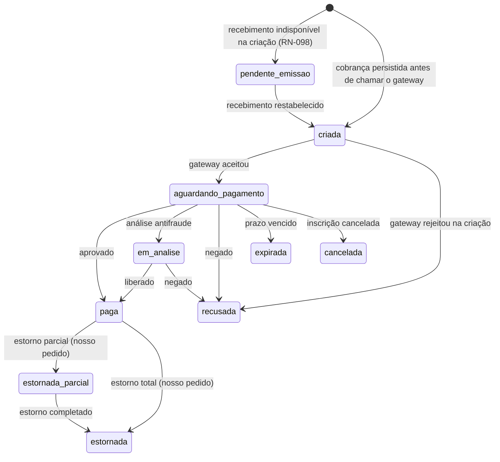
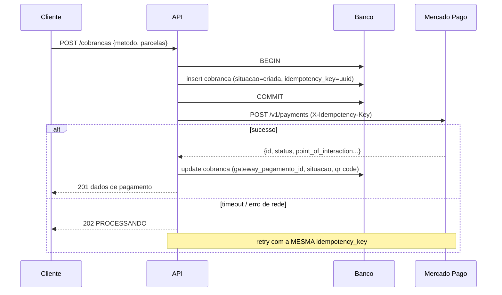

# 03 — Cobrança e pagamento

Integração com Mercado Pago no **modelo marketplace**: o pagamento é criado em nome da conta conectada do inquilino, e a plataforma retém sua taxa como tarifa de aplicação. Pix à vista e cartão de crédito parcelado (RN-040).

> Os nomes de campo da API do Mercado Pago aqui refletem a API de pagamentos v1 e o fluxo de marketplace. Confira contra a documentação vigente antes de implementar — em especial `application_fee`, o fluxo OAuth e o refresh de token, que são a parte que mais muda.

## 1. Máquina de estados



`charged_back` (contestação) **não** é mapeado para `estornada` — grava nos campos `contestacao_*` da cobrança, sem mudar `situacao` (RN-064, §1 abaixo).

| Situação Mercado Pago | Situação nossa |
|---|---|
| `pending` | `aguardando_pagamento` |
| `in_process`, `in_mediation` | `em_analise` |
| `approved`, `authorized` | `paga` |
| `rejected` | `recusada` |
| `cancelled` | `cancelada` (ou `expirada`, se por vencimento) |
| `refunded` | `estornada` (nosso pedido de estorno) |
| `charged_back` | não muda `situacao` — grava `contestacao_situacao = aberta` (RN-064) |

**RN-300 (RN-037, RN-064)** — `charged_back` (contestação de cartão) não é estorno comum e não é tratado nos campos de estorno: além de gravar `contestacao_*`, gera pendência visível para a coordenação, porque o dinheiro já saiu e a inscrição continua `confirmada`. Não é revertida automaticamente — a coordenação decide entre cobrar de novo e cancelar. Só `contestacao_situacao = revertida` fecha a pendência sozinha; `perdida` a mantém aberta, porque é o desfecho em que o dinheiro definitivamente não volta.

**RN-301** — De `paga` não se volta para `aguardando_pagamento`. Estado terminal do lado do recebimento; correção é estorno, não regressão.

---

## 2. Criação da cobrança

### 2.1 Pré-condições

- Inscrição em `pendente_pagamento` (nunca em `lista_espera` — RN-033)
- Sem cobrança viva para a inscrição (`cobranca_viva_unica`)
- Antes do **marco de corte do pagamento online** (`data_inicio` do encontro, fuso `America/Sao_Paulo` — RN-041); marco do encontro, não da janela de inscrição, e não se move com `inscricoes_fecham_em`
- Nenhuma: sem conexão de gateway ativa (RN-123), a cobrança **não falha** — nasce em `pendente_emissao` (RN-098, ver §7.3)

### 2.2 Sequência obrigatória



**RN-143 (do modelo de dados), reforçada aqui** — a cobrança é persistida em `criada` com a `idempotency_key` **antes** da chamada. É o que torna o retry seguro: em timeout, não sabemos se o Mercado Pago criou o pagamento; repetir com a mesma chave devolve o pagamento original em vez de criar um segundo.

**RN-302** — Timeout na chamada ao gateway nunca vira `500` genérico. Retorna `202` com a cobrança em `criada`, e uma rotina de reconciliação ([04-webhook.md](04-webhook.md#6-reconciliação)) resolve a situação real. A interface mostra "processando" e faz polling. Tratar timeout como falha faz o usuário clicar de novo e é assim que nasce pagamento duplicado.

**RN-144 (do modelo de dados)** — Cobrança em `criada` há mais de 15 minutos sem `gateway_pagamento_id` é investigada pela reconciliação pela `idempotency_key` antes de qualquer nova tentativa.

### 2.3 Parcelamento (RN-040)

```
parcelas_maximas = min(
  central.max_parcelas,
  floor(valor / central.parcela_minima)
)
```

Com valor de R$ 350,00, `parcela_minima` R$ 50,00 e `max_parcelas` 12 → máximo 7 parcelas.

`parcelas_maximas` sempre >= 1, mesmo se o valor for menor que a parcela mínima.

**RN-304 (RN-101)** — Parcela é sempre com juros do comprador (o inscrito paga o acréscimo), nunca do vendedor. A central recebe o valor cheio da taxa. O juro **não entra** no `valor` da cobrança nem no `valor_devido`: ele é somado pelo emissor do cartão, não é arrecadado pela central e não é receita da plataforma.

**RN-305 (RN-101)** — O valor mostrado por parcela vem do endpoint de meios de pagamento do gateway, não de conta nossa. Taxa de parcelamento muda e cálculo local diverge da fatura. A tela também mostra de onde vem o acréscimo e que ele **não volta no reembolso** (RN-060), porque nunca esteve com a central.

### 2.4 Pix

`expira_em = min(criada_em + 24h, data_inicio)` (RN-041) — nunca depois do **marco de corte do pagamento online**, que é do encontro, não da janela de inscrição, e não se move com `inscricoes_fecham_em`.

Da resposta, guardamos `point_of_interaction.transaction_data.qr_code` (copia e cola), `qr_code_base64` (imagem) e `ticket_url`.

**RN-306 (RN-041)** — Pix expirado pode ser regerado pelo próprio inscrito, com três limites: antes do marco de corte do pagamento online; enquanto a inscrição ocupar vaga (RN-033) — quem caiu para `lista_espera` por prazo estourado não regera nada; e no máximo 5 vezes (RN-307). A regeneração **cancela a cobrança anterior** no mesmo ato e cria outra, mantendo `cobranca_viva_unica`. Regenerar sem cancelar é como a pessoa acaba com dois QR codes válidos e paga os dois. O valor da nova cobrança é o `valor_devido` congelado da inscrição (RN-038), não a taxa vigente do encontro.

**RN-307 (RN-041)** — Máximo 5 regerações por inscrição. Acima disso, `429` e orientação para falar com a secretaria, que recebe presencialmente (`dinheiro`, `pix_presencial` — RN-040, RN-044).

### 2.5 Cartão

O front usa o SDK do Mercado Pago para tokenizar. **O cartão nunca passa pela nossa API** (RN-042). Recebemos apenas `token`, `paymentMethodId`, `issuerId`, `installments` e os dados do pagador.

**RN-308** — O `device_id` gerado pelo script de segurança do gateway é enviado no cabeçalho da criação do pagamento. Sem ele a taxa de aprovação cai de forma perceptível.

**RN-309** — Token de cartão é de uso único e expira em minutos. Falha por token expirado retorna `422 TOKEN_EXPIRADO` com orientação de refazer, não é tratada como recusa do cartão — a mensagem para o usuário é completamente diferente.

---

## 3. Endpoints

### 3.1 `POST /api/publico/inscricoes/:token/cobrancas`

Pix:

```json
{ "metodo": "pix" }
```

`201`:

```json
{
  "cobrancaId": "01903f...",
  "metodo": "pix",
  "situacao": "aguardando_pagamento",
  "valor": 350.00,
  "expiraEm": "2026-08-23T18:00:00Z",
  "pixQrCode": "00020126580014BR.GOV.BCB.PIX0136...",
  "pixQrCodeBase64": "iVBORw0KGgoAAAANSUhEUg...",
  "ticketUrl": "https://www.mercadopago.com.br/payments/..."
}
```

Cartão:

```json
{
  "metodo": "cartao_credito",
  "token": "ff8080814c11e237014c1ff593b57b4d",
  "paymentMethodId": "master",
  "issuerId": "24",
  "parcelas": 6,
  "deviceId": "armor.abc123...",
  "pagador": {
    "email": "joao@exemplo.com",
    "identificacao": { "tipo": "CPF", "numero": "12345678901" }
  }
}
```

`201`:

```json
{
  "cobrancaId": "01903f...",
  "metodo": "cartao_credito",
  "situacao": "paga",
  "valor": 350.00,
  "parcelas": 6,
  "valorParcela": 62.35,
  "bandeira": "master",
  "ultimosQuatro": "1234"
}
```

Erros:

| HTTP | Código | Situação |
|---|---|---|
| 409 | `COBRANCA_JA_EXISTE` | já há cobrança viva; devolve a existente |
| 409 | `CONFLITO_DE_SITUACAO` | inscrição não está em `pendente_pagamento` |
| 422 | `PARCELAS_INVALIDAS` | acima do máximo calculado |
| 422 | `TOKEN_EXPIRADO` | token de cartão vencido |
| 402 | `PAGAMENTO_RECUSADO` | recusa do emissor; inclui `motivoRecusa` |
| 202 | `PROCESSANDO` | timeout no gateway (RN-302) |
| 429 | `MUITAS_TENTATIVAS` | limite de regeração ou de tentativas |

Não há erro para conexão de gateway indisponível: a cobrança nasce `pendente_emissao` (RN-098, §7.3) e a resposta é `201`, sem `qrCode`/`linkPagamento`, com a vaga já reservada.

**RN-310** — `409 COBRANCA_JA_EXISTE` devolve os dados da cobrança viva em vez de só recusar. O usuário que clicou duas vezes recebe o mesmo QR code, e não um erro.

**RN-311** — `motivoRecusa` é traduzido para linguagem de usuário. `cc_rejected_insufficient_amount` vira "saldo ou limite insuficiente"; `cc_rejected_bad_filled_security_code` vira "código de segurança incorreto". Código cru do gateway não vai para a tela.

### 3.2 `POST /api/publico/inscricoes/:token/cobrancas/:id/regerar`

Só para Pix `expirada` ou `aguardando_pagamento` (RN-306, RN-307). Cancela a anterior e cria nova, em transação.

### 3.3 `GET /api/publico/inscricoes/:token/cobrancas/:id`

Polling da interface enquanto o Pix não cai. Retorna a situação atual.

**RN-312** — Este endpoint lê **do nosso banco**, nunca chama o gateway. Polling de front batendo em API externa esgota rate limit em pico de inscrição. A atualização chega pelo webhook. Intervalo recomendado: 5s nos 2 primeiros minutos, 15s depois, parando em 15 minutos.

### 3.4 Administrativos

| Método | Rota | Ação |
|---|---|---|
| `GET` | `/api/admin/encontros/:id/cobrancas` | listagem com filtro por situação e método |
| `POST` | `/api/admin/cobrancas/:id/sincronizar` | força consulta ao gateway e atualiza |
| `POST` | `/api/admin/cobrancas/:id/estornar` | estorno manual, total ou parcial |
| `GET` | `/api/admin/encontros/:id/conciliacao` | divergências entre nosso estado e o gateway |

---

## 4. Confirmação e RN-051

**A confirmação da inscrição acontece exclusivamente pelo webhook.** O retorno do navegador (`back_urls`) atualiza a tela, nada mais.

Motivo, concreto: o usuário paga no app do banco e fecha o navegador antes de voltar; paga e perde o sinal; ou abre a `back_url` manualmente sem ter pago. Confiar no retorno do front produz inscrição confirmada sem dinheiro e inscrição paga sem confirmação — os dois erros, na mesma implementação.

Exceção controlada: pagamento com cartão aprovado de forma síncrona já retorna `approved` na criação. Nesse caso a confirmação pode ser aplicada na hora, **pelo mesmo serviço de domínio que o webhook usa**, e o webhook subsequente é idempotente e não faz nada. Não é uma segunda regra, é a mesma função chamada de outro lugar.

---

## 5. Expiração (RN-052)

Rotina a cada 5 minutos:

1. `cobranca` em `aguardando_pagamento` com `expira_em < now()` → `expirada`.
2. `inscricao` em `pendente_pagamento` há mais de 72h, sem cobrança paga → `lista_espera`, com posição no fim da fila, liberando a vaga.
3. Avisos em 24h e 48h antes disso, via `notificacao` (RN-136 impede duplicidade).

**RN-313 (RN-052)** — A contagem das 72h começa na criação da inscrição, não na criação da cobrança. Senão, quem nunca gera cobrança segura a vaga para sempre.

**RN-314 (RN-052)** — A rotina não expira inscrição cuja cobrança esteja em `em_analise`, nem cuja cobrança esteja em `pendente_emissao` por indisponibilidade de recebimento (RN-098) — a falha é nossa, não do inscrito, e o relógio começa a contar quando a cobrança é emitida e o inscrito recebe o link. Análise antifraude pode passar de 72h e derrubar quem está com pagamento em curso é inaceitável.

---

## 6. Estorno

`POST /v1/payments/{id}/refunds`, com `amount` para parcial e corpo vazio para total.

```
estorno_valor = estorno_valor + valor_do_estorno         -- acumulador, nunca sobrescrito
situacao = 'estornada' se estorno_valor >= valor, senão 'estornada_parcial'
estorno_situacao = 'solicitado'                            -- aceite do pedido
```

`estorno_valor`, `estorno_tarifa_gateway` e `taxa_estornada` são **acumuladores** da vida inteira da cobrança — a mesma cobrança pode ter mais de um estorno (parcial por engano, depois o do cancelamento sobre o saldo). `estorno_situacao` e `estorno_atualizado_em` são do **último pedido**, não da soma. Pedido novo só é aceito quando não há outro em `solicitado` nem em `indeterminado` — pedir por cima de um pedido em trânsito devolve o dinheiro duas vezes.

**RN-315** — Estorno também usa chave de idempotência, derivada de `{cobranca_id}:{valor}:{tentativa}`. Retry de estorno sem idempotência devolve o dinheiro duas vezes.

**RN-316 (RN-062)** — Pix estornado depende de saldo na conta do Mercado Pago. Falha por saldo insuficiente grava `estorno_situacao = recusado`, retorna `502 FALHA_NO_ESTORNO` e vira pendência para a coordenação (RN-208), nunca fica silenciosa. Falha **sem resposta** do gateway (timeout, `5xx`, conexão indisponível) grava `estorno_situacao = indeterminado` em vez de `recusado` — o resultado é desconhecido, não negado —, com o pedido repetido pela mesma chave de idempotência até o gateway responder; a inscrição continua `confirmada` e nada é liberado para a fila em nenhum dos dois casos.

**RN-317 (RN-063)** — Estorno tem **dois** marcos. O **aceite** — a API respondeu que recebeu o pedido — grava `estorno_situacao = solicitado` e é ele, e só ele, que libera o passo 5 da ordem de cancelamento ([02-inscricao.md §3.2](02-inscricao.md#32-ordem-das-operações-rn-062)): esperar a confirmação deixaria a inscrição pendurada por dias, ocupando vaga que já não tem dono. A **efetivação** — o webhook de `refunded` — grava `estorno_situacao = concluido` e `estorno_atualizado_em`; só aí o reembolso está efetivado e só aí sai a notificação de reembolso concluído. Entre um marco e outro a inscrição está `cancelada` e a consulta por token diz "reembolso solicitado", com a data do pedido — a resposta síncrona da API não é prova de dinheiro devolvido. Estorno aceito sem confirmação em **7 dias** vira pendência para a coordenação. Estorno aceito que depois é **recusado ou revertido** grava `estorno_situacao = recusado` e vira a mesma pendência — a inscrição continua `cancelada` (de `cancelada` não se sai), e o que a central deve entra na lista de devoluções pendentes até zerar.

---

## 7. Split e taxa da plataforma

O dinheiro **não passa pela conta do operador** (RN-082t). O pagamento é criado com o `access_token` da conta conectada do inquilino, e a plataforma retém sua fatia via `application_fee` na mesma requisição.

### 7.1 Cálculo (RN-043)

```
taxa_plataforma = round(base_taxa_encontro * taxa_plataforma_percentual / 100, 2)
```

**A base é a parcela de taxa do encontro que aquela cobrança está cobrando, nunca o `valor` da cobrança** — que já contém o repasse, quando há repasse (§7.2), e tornaria a fórmula circular. Na cobrança comum, que cobra a inscrição inteira, `base_taxa_encontro` é o `valor_devido` congelado (RN-038): R$ 350,00 × 2,5% = R$ 8,75. Na cobrança de **complemento** que a RN-037 manda emitir depois de um estorno parcial, a base é só a **diferença** que falta para o `valor_devido` — uma diferença de R$ 100,00 gera R$ 2,50 de taxa, não R$ 8,75 de novo. `taxa_plataforma_percentual` é o percentual **congelado na inscrição** na criação, não o vigente do inquilino (RN-096, §4.5) — calculada e congelada na criação da cobrança, junto com o percentual usado. Mudança de percentual não alcança cobrança já criada.

**RN-321** — A tarifa vai no `application_fee` da própria criação do pagamento, nunca por transferência posterior. Transferência posterior faz o operador figurar como intermediário do dinheiro da denominação — problema fiscal, não só técnico.

**RN-322** — `application_fee` nunca excede o valor do pagamento, garantido por `cobranca_taxa_ate_o_valor` no banco. Percentual mal configurado é erro de cadastro, não pode virar cobrança rejeitada na cara do inscrito.

### 7.2 Quem paga a taxa (RN-096)

`taxa_plataforma_repassada` e `taxa_plataforma_percentual` são congeladas na **inscrição**, na criação (§4.5) — a cobrança lê os dois de lá, nunca do inquilino vigente, inclusive a cobrança emitida semanas depois na promoção da lista de espera ou no restabelecimento do recebimento.

| `taxa_plataforma_repassada` | Inscrito paga | Central recebe |
|---|---|---|
| `false` (padrão) | R$ 350,00 | R$ 350,00 − tarifa − tarifa do gateway |
| `true` | R$ 350,00 + tarifa | R$ 350,00 − tarifa do gateway |

**RN-323 (RN-096)** — Com repasse ativo, o valor acrescido aparece **discriminado**, nunca embutido num total redondo: "taxa do encontro R$ 350,00 + taxa de serviço R$ 8,75". Vale na página do encontro, na ficha antes de confirmar, no e-mail de cobrança e na consulta por token. Embutir no total sem discriminar é o tipo de coisa que a denominação descobre por reclamação de participante.

**RN-324 (RN-096)** — Trocar o modo de repasse não altera cobrança já criada, inscrição já criada nem `valor_devido` já congelado. A mudança vale para inscrição criada depois — a âncora é a inscrição, não o inquilino vigente.

### 7.3 Conexão OAuth (RN-104, RN-105)

O admin da denominação (ou o admin da central, se a conexão for por central) autoriza a plataforma; recebemos `access_token` e `refresh_token`, guardados no cofre por referência, nunca em coluna de tabela (RN-104).

**RN-325 (RN-098)** — Toda chamada ao gateway resolve a conexão antes: primeiro a da central, depois a do inquilino (RN-123, RN-105). Não havendo conexão ativa, a criação **não falha**: a inscrição é aceita, ocupa vaga normalmente, e a cobrança nasce em **`pendente_emissao`** (§1) — situação própria, não ausência de cobrança. Nunca se cria cobrança sem destino do dinheiro. A área pública continua no ar, com valor e vagas; nada expira e nenhuma vaga muda de dono por causa da falha (RN-098).

**RN-326 (RN-098)** — Rotina diária renova token com menos de 15 dias para expirar (RN-122). Três falhas desativam a conexão e bloqueiam a emissão de cobrança nova, com alerta a operador e admin da denominação **antes** que a primeira inscrição falhe.

**RN-327 (RN-098)** — Token revogado pelo inquilino no painel do Mercado Pago é detectado no primeiro `401` do gateway: a conexão é desativada na hora e o admin é notificado com o passo a passo de reconexão.

**Restabelecida a conexão**, a plataforma emite as cobranças pendentes na ordem em que as inscrições entraram, pelo `metodo` que a pessoa escolheu na ficha — sem escolha registrada (criação administrativa, ou falha antes da escolha), emite `pix`. Passado o marco de corte do pagamento online (RN-041) sem restabelecimento, essas inscrições são quitadas na recepção (RN-070).

### 7.4 Estorno da taxa (RN-097)

```
taxa_estornada = round(taxa_plataforma * (valor_do_estorno / valor), 2)
```

**RN-328 (RN-097)** — Estorno devolve a tarifa proporcionalmente — vale para o estorno da desistência, para o cancelamento do encontro e para a contestação de cartão (RN-064). A plataforma não fica com taxa de dinheiro que não ficou com a central; em estorno total, a tarifa devolvida é integral. Quem recebe a devolução depende de quem pagou: com repasse, volta para o inscrito junto com o resto do reembolso; sem repasse, volta para a central. Contestação **revertida** refaz o caminho: o dinheiro volta para a central e a taxa volta a ser devida, desfazendo a `taxa_estornada` correspondente.

### 7.5 Apuração (RN-102)

**RN-329 (RN-102)** — O faturamento da plataforma é apurado a partir de **toda cobrança que recebeu pagamento**, qualquer que seja a `situacao` em que ela esteja hoje — não só `situacao = 'paga'` —, somando `taxa_plataforma − taxa_estornada` por inquilino e período. Cobrança estornada em parte deixa de estar `paga` e **continua entrando** na apuração, com a taxa menos a proporção que voltou; somar só `paga` derrubaria da conta exatamente os casos que o estorno parcial existe para tratar. É relatório para faturamento externo, não movimento financeiro: o dinheiro já foi retido no split.

**RN-330 (RN-102)** — A apuração é conciliada mensalmente com o relatório de tarifas do gateway. Divergência é alerta para o operador, nunca ajuste automático no nosso número.

---

## 8. Segurança

**RN-318** — Credenciais do Mercado Pago são por conexão (inquilino ou central), lidas do cofre por referência (RN-104), carregadas em memória com TTL curto e nunca logadas. Log de requisição ao gateway mascara `Authorization` e qualquer campo de pagador.

**RN-331** — O token de um inquilino jamais é usado para criar pagamento de outro. A conexão é resolvida a partir do `inquilino_id` da própria cobrança, sob RLS, nunca de parâmetro de requisição.

**RN-319** — `payload_gateway` e `webhook_evento.corpo_bruto` são gravados sem os campos de portador de cartão. Guardar resposta bruta é útil para depurar e perigoso se guardar demais.

**RN-320** — Toda operação de cobrança grava em `auditoria` com ator (`publico`, `usuario`, `sistema`, `webhook`), valor antes e depois. É a base da prestação de contas da fase 3.
