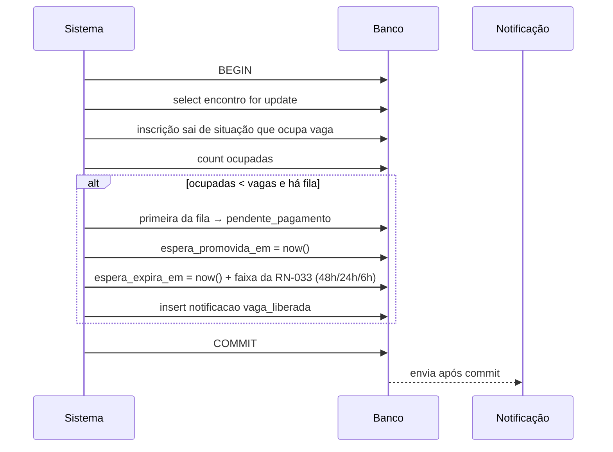

# 05 — Lista de espera e controle de vagas

Implementa RN-033 e RN-052. A seção 3 é o ponto de maior risco técnico da fase 1.

## 1. Ocupação de vaga

Ocupam vaga: `pendente_pagamento`, `confirmada`, `presente`.
Não ocupam: `lista_espera`, `cancelada`, `ausente`.

Contagem sempre por `(encontro_id, tipo)` — participante e servo têm vagas e filas independentes (RN-033).

**RN-500** — Não existe contador denormalizado de vagas ocupadas. A ocupação é sempre `count(*)` sob lock. Contador desnormalizado dessincroniza em cancelamento concorrente, expiração e estorno, e a divergência só aparece quando alguém fica sem vaga tendo pago.

---

## 2. Fila

`posicao_espera` é inteiro crescente por `(encontro_id, tipo)`, com unique parcial ([01-modelo-de-dados.md](01-modelo-de-dados.md#36-inscricao)).

**RN-501** — Posições não são renumeradas quando alguém sai da fila. Sair da posição 3 deixa a sequência 1, 2, 4, 5 — a ordem relativa é o que importa. Renumerar exige `update` em massa sob concorrência e é fonte de deadlock. A interface mostra a posição **ordinal calculada** (`row_number()`), não o valor cru da coluna.

**RN-502 (RN-033)** — Quem perde o prazo depois de promovido volta ao **fim** da fila, com nova `posicao_espera = max + 1`, não à posição original. Manter a posição permitiria segurar a vaga indefinidamente sem pagar. `posicao_espera` é chave de ordenação reatribuída a cada retorno ao fim da fila, não registro de chegada — não serve para responder "há quanto tempo essa pessoa espera" (isso sai de `data_inscricao` e da auditoria).

---

## 3. Concorrência na última vaga

O cenário: 1 vaga restante, duas inscrições simultâneas. Sem controle, as duas leem "1 vaga disponível", as duas inserem, e o encontro fica com 61 participantes em 60 lugares — descoberto na recepção da sexta à noite.

### Abordagem descartada

Verificar em código e inserir: as duas requisições passam pela verificação antes de qualquer insert. Clássico TOCTOU.

`serializable` no Postgres resolveria, mas ao custo de erros de serialização em pico de inscrição, exatamente quando não se pode falhar.

### Abordagem adotada — lock na linha do encontro

```sql
begin;

-- serializa todas as inscrições deste encontro
select id from encontro where id = $1 for update;

select count(*) as ocupadas
from inscricao
where encontro_id = $1
  and tipo = $2
  and situacao in ('pendente_pagamento', 'confirmada', 'presente');

-- decide: ocupadas < vagas ? pendente_pagamento : lista_espera

insert into inscricao (...) values (...);

commit;
```

**RN-503** — Toda criação de inscrição e toda promoção da lista de espera adquire `for update` na linha do `encontro` antes de contar. É o único lock da operação e a ordem é sempre a mesma (encontro → inscricao → cobranca), o que elimina deadlock.

**RN-504** — A transação que decide a vaga **não** chama o gateway. Ela cria a inscrição e termina. A cobrança é criada em requisição separada. Manter chamada de rede dentro de transação com lock de linha é como um gateway lento vira fila de espera no banco.

**RN-505** — O lock é por encontro, não global e não por inquilino. Encontros diferentes não se bloqueiam, nem dentro da mesma denominação nem entre denominações. Um encontro tem no máximo algumas dezenas de inscrições por minuto no pico de abertura, o que o Postgres serializa sem esforço.

**RN-517** — O `select ... for update` no encontro roda sob a RLS do inquilino: uma sessão não consegue nem sequer travar a linha de encontro de outro inquilino, porque a linha não é visível para ela. O lock não abre caminho lateral em volta do isolamento.

### Por que não índice único como no RN-031

Não dá: "no máximo N linhas" não é expressável em unique constraint. Exclusion constraint não cobre contagem. O lock é a ferramenta certa.

---

## 4. Liberação de vaga

Uma vaga é liberada quando uma inscrição que ocupava vaga sai:

- Cancelamento pelo inscrito ou pela coordenação, com o estorno aceito (RN-062)
- Expiração das 72h (RN-052)

Estorno ou contestação **não** libera vaga sozinho (RN-037, RN-064): a inscrição continua `confirmada` até a coordenação decidir, e a vaga só é oferecida à fila se a decisão for cancelar.

Sequência:



**RN-506** — A promoção acontece na **mesma transação** da liberação. Fazer em rotina separada deixa a vaga vazia por minutos e permite que uma inscrição nova entre na frente de quem esperou duas semanas na fila.

**RN-507** — A notificação é enfileirada dentro da transação e enviada **depois do commit**. Enviar antes do commit e ter rollback significa dizer a alguém que a vaga é dele quando não é.

**RN-508 (RN-033)** — A liberação promove **uma** inscrição por vaga liberada. Cancelamento em lote de 3 inscrições promove exatamente 3, executando o laço enquanto `ocupadas < vagas` e houver fila.

---

## 5. Prazo do promovido

**RN-509 (RN-033)** — Quem é promovido tem prazo para pagar (`espera_expira_em`), não as 72h da inscrição normal (RN-052). Motivo: perto da data do encontro não há tempo para ciclos de 72h. O prazo encurta conforme o encontro se aproxima, contado em `dias_ate_o_encontro` (diferença entre `data_inicio` e o momento da promoção, em dias corridos inteiros arredondados para baixo, fuso `America/Sao_Paulo`):

```
dias_ate_o_encontro > 7        → 48h
2 <= dias_ate_o_encontro <= 7  → 24h
dias_ate_o_encontro < 2        → 6h
```

As três faixas cobrem toda a reta e não se sobrepõem: 7 dias exatos e 2 dias exatos dão 24h.

**RN-510 (RN-033)** — Promovido que não paga no prazo volta ao fim da fila (RN-502) e a vaga passa ao próximo, imediatamente e na mesma transação — enquanto `inscricoes_fecham_em` não passou (RN-023). Depois do fechamento das inscrições o desfecho muda: ver §6.

**RN-511** — A notificação de promoção informa o prazo em data e hora explícitas, no fuso de Brasília, não em "você tem 48 horas". Mensagem lida no dia seguinte com contagem relativa induz a erro.

---

## 6. Fechamento das inscrições

**RN-512 (RN-023, RN-035, RN-036)** — Passado `inscricoes_fecham_em`, a fila é congelada: sem novas entradas e sem promoção automática. Vaga liberada depois disso é preenchida manualmente pela coordenação, que nessa altura já está montando grupos e precisa decidir caso a caso, por **dois** caminhos: promoção manual de quem está na fila (RN-036, §7) e criação administrativa de quem nunca se inscreveu (RN-035) — o substituto de última hora quase nunca está na fila.

**Prazo do promovido estourado depois do fechamento.** O prazo da RN-033/RN-509 continua sendo gravado e comunicado depois do fechamento, inclusive na promoção manual (RN-036), mas o estouro **não** devolve o promovido à fila e **não** passa a vaga ao próximo automaticamente — nada expira sozinho depois do fechamento (RN-052). Ele vira **pendência de vaga** no painel do encontro (RN-115), com pessoa, valor e a hora em que o prazo venceu, e a coordenação escolhe: manter a vaga (a pessoa paga na recepção, com `dinheiro` ou `pix_presencial` — RN-040, RN-070) ou cancelar (RN-030) e chamar outra pessoa, por nova promoção manual ou por criação administrativa (RN-035).

**RN-513 (RN-033, §7)** — Ao encerrar as inscrições, quem ficou em `lista_espera` recebe aviso de que não foi possível acomodar, com convite para o próximo encontro da central. Sem isso a pessoa fica esperando indefinidamente e vai atrás pelo WhatsApp da coordenação. A inscrição **continua** em `lista_espera` — não vai para `cancelada` — e fica disponível para promoção manual até o encontro começar; só quando o encontro é encerrado é que quem sobrou na fila passa a `cancelada` pelo sistema.

---

## 7. Promoção manual

`POST /api/admin/encontros/:id/lista-espera/promover`

```json
{ "inscricaoId": "01903f...", "justificativa": "esposa de servo confirmado" }
```

**RN-514 (RN-036)** — A coordenação pode promover fora de ordem, com justificativa obrigatória, registrada em auditoria. O caso existe: casal que se inscreveu junto, parente de servo, alguém que já estava confirmado e teve o pagamento estornado por engano. Regra sem escape faz a coordenação resolver por fora, no banco, e aí o controle acaba.

**RN-515 (RN-036)** — Promoção manual acima do limite de vagas exige papel `admin_central` e gera alerta permanente no painel do encontro (RN-115). Não é bloqueada — capacidade real de um sítio muitas vezes tem folga que o número cadastrado não reflete — mas fica visível.

---

## 8. Endpoints

### `GET /api/admin/encontros/:id/lista-espera`

Query: `tipo` (`participante` | `servo`).

```json
{
  "tipo": "participante",
  "vagas": 60,
  "ocupadas": 60,
  "fila": [
    {
      "inscricaoId": "01903f...",
      "posicao": 1,
      "nome": "Carlos Eduardo Lima",
      "telefone": "45988887777",
      "inscritoEm": "2026-08-14T13:22:00Z",
      "convidador": "Pedro Alves",
      "jaFoiPromovido": false
    }
  ]
}
```

`posicao` é ordinal calculado (RN-501). `jaFoiPromovido` mostra quem já perdeu um prazo — informação que a coordenação usa antes de ligar de novo.

### `GET /api/publico/inscricoes/:token`

Para inscrição em espera, acrescenta:

```json
{
  "situacao": "lista_espera",
  "posicaoEspera": 4,
  "totalNaFila": 11,
  "cobranca": null
}
```

**RN-516** — A posição na fila é mostrada ao inscrito. Sem esse número a secretaria recebe a mesma pergunta por telefone todos os dias.

---

## 9. Teste

1. Inscrição com vaga → `pendente_pagamento`. Sem vaga → `lista_espera` com posição.
2. **Concorrência:** 50 requisições simultâneas para 1 vaga → exatamente 1 em `pendente_pagamento`, 49 em espera, com posições únicas e sem deadlock.
3. Cancelamento promove a primeira da fila na mesma transação.
4. Cancelamento em lote de 3 promove exatamente 3 (RN-508).
5. Promovido não paga no prazo → volta ao fim, próximo é promovido.
6. Inscrição em espera não gera cobrança (RN-033).
7. Fila esvaziada não promove ninguém, sem erro.
8. Depois de `inscricoes_fecham_em`, cancelamento não promove (RN-512).
9. Promoção manual fora de ordem exige justificativa e é auditada.
10. Prazo do promovido varia conforme a proximidade do encontro (RN-509).
11. Posições permanecem únicas depois de saídas no meio da fila.
12. Participante e servo têm filas independentes: esgotar vaga de participante não afeta servo.
13. Concorrência simultânea em encontros de inquilinos diferentes não gera contenção nem interferência entre as filas.
